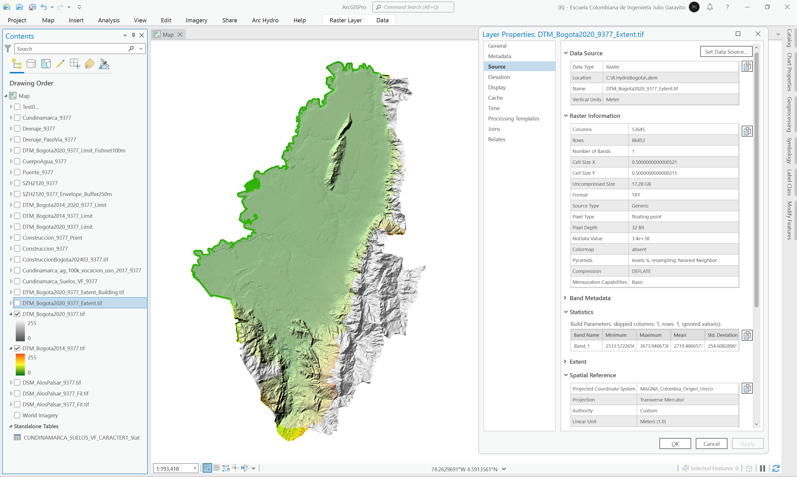

# Modelo digital de elevación - DEM

Esta carpeta contiene los modelos digitales de elevación DEM (DTM, DSM, Híbridos) utilizados para la modelación en HEC-RAS y los modelos digitales de elevación para corrección de drenajes en pasos de vía.

> Para conocer los archivos fuente a partir de los cuales se generaron los diferentes shapefile, diríjase a la sección [.data](../.data) de este repositorio.
> 
> :lady_beetle:Atención: Para la correcta creación de terrenos en RAS Mapper, los archivos de modelos digitales de terreno deberán proyectarse utilizando el CRS MAGNA_OrigenNacional.prj disponible en la carpeta [.data](../.data) o en la carpeta .projectionfile del modelo hidráulico HEC-RAS.
> 
> Debido al tamaño de los modelos digitales, modelos superiores a 500MB han sido publicados en este repositorio a través de _Releases_, los archivos menores son incluídos directamente en la carpeta _.DEM_ en comprimidos de 99MB.

## DTM Lidar Bogotá 2020 extendido (0.5m)

A partir del modelo digital de terreno Lidar Bogotá 2014 (5m) que incluye información digital sobre el corredor completo del Río Bogotá en la zona perimetral de la ciudad y el modelo digital de terreno Lidar Bogotá 2020 (0.5m) que solo presenta información hasta la línea central del cauce del Río Bogotá, se ha generado el modelo extendido Lidar 2020 en resolución 0.5m.

:open_file_folder: Archivo local: [DTM_Bogota2014_9377.tif](DTM_Bogota2014_9377.rar)  
:open_file_folder: Release: [DTM_Bogota2020_9377.tif](https://github.com/rcfdtools/R.HydroBogota/releases/tag/DTM_Bogota_2020_4326_v1.0.0)  
:open_file_folder: Release: [DTM_Bogota2020_9377_Extent.tif](DTM_Bogota2020_9377_Extent.rar)

En la siguiente imagen se presenta en color el cubrimiento del DTM Lidar 2014, y en escala de grises el cubrimiento del DTM Lidar 2020 de Bogotá D.C., en la zona occidental se puede observar en color resaltado las localizaciones que no han sido incluídas en el Lidar 2020, y en la zona oriental las nuevas incorporaciones del modelo 2020.

**Geo-procesos ArcGIS Pro**  
* Data Management Tools / Raster / Mosaic To New Raster: ordenamiento superior Lidar 2020 e inferior Lidar 2014.

