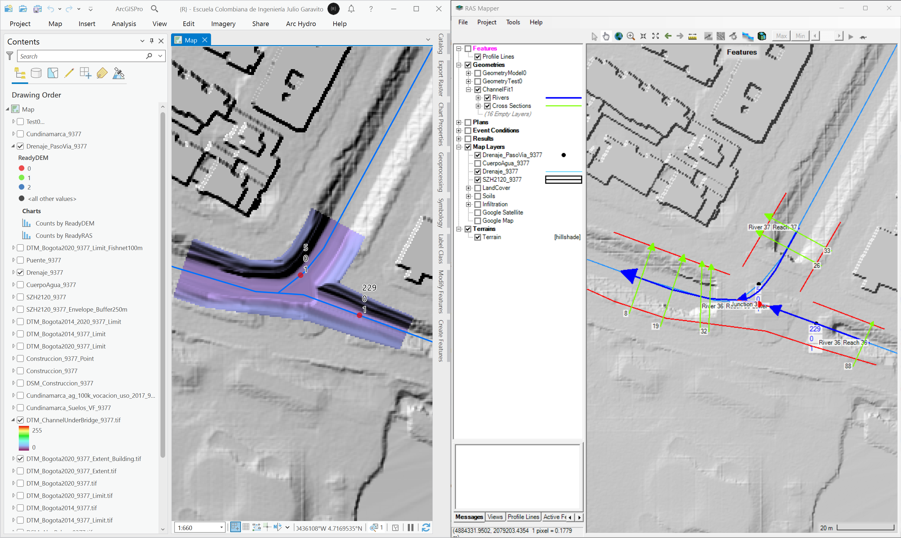
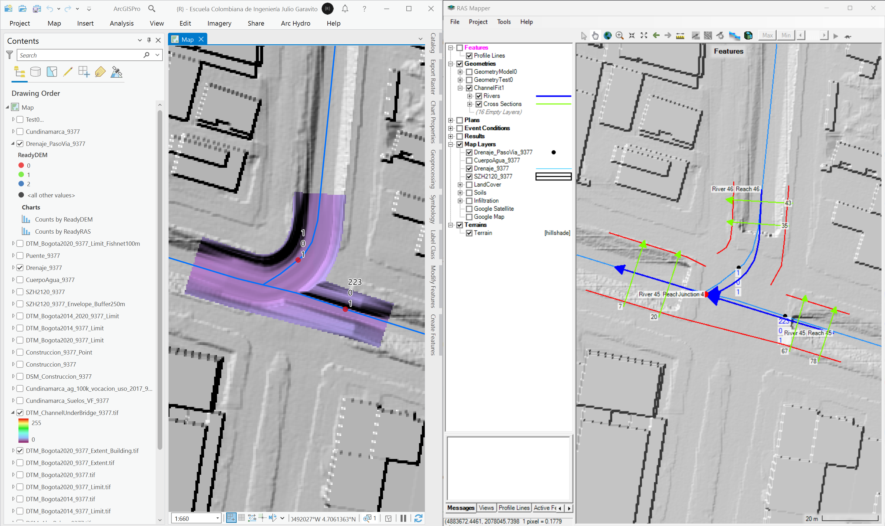
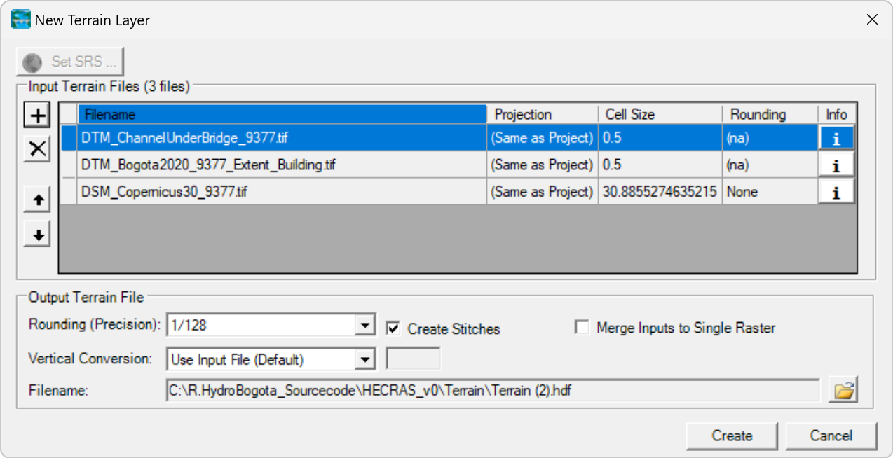

# Modelos digitales de elevación - DEM

Esta carpeta contiene los modelos digitales de elevación (de terreno o DTM, de superficie o DSM e híbridos) que son utilizados en las modelaciones hidráulicas 2D para obtener las propiedades geométricas de las celdas del modelo. Los modelos digitales de terreno en canales en puntos de intersección de pasos de vía con drenajes, generados a partir de secciones de muestreo y ejes, son utilizados para la corrección o limpieza de canales en pasos de vía.

> Para conocer los archivos fuente a partir de los cuales se generaron los diferentes shapefile, diríjase a la sección [.data](../.data) de este repositorio.
> 
> :lady_beetle:Atención: Para la correcta creación de terrenos en RAS Mapper, los archivos de modelos digitales de terreno deberán proyectarse utilizando el CRS MAGNA_OrigenNacional.prj disponible en la carpeta [.data](../.data) o en la carpeta .projectionfile del modelo hidráulico HEC-RAS.
> 
> Debido al tamaño de los modelos digitales, modelos superiores a 500MB han sido publicados en este repositorio a través de _Releases_, los archivos menores son incluídos directamente en la carpeta _.DEM_ en comprimidos de 99MB.

## Modelo digital de superficie DSM satelital NASA ALOS PALSAR (12.5m)

Modelo de superficie con cobertura completa sobre toda la zona de estudio y utilizado para modelación hidráulica, requerido para la creación del modelo híbrido de elevación de toda la cuenca del Río Bogotá. Debido a que corresponde a un modelo DSM, es necesario realizar el ajuste de las elevaciones utilizando la ecuación obtenida de la regresión lineal obtenida a partir de la red de muestreo FishNet, generada, procesada y documentada en la carpeta de archivos vectoriales [.shp](../.shp).

:open_file_folder: Ráster original DSM_AlosPalsar_9377.tif en mosaico reproyectado, comprimido en 2 partes de 99MB: [P1](DSM_AlosPalsar_9377.part1.rar), [P2](DSM_AlosPalsar_9377.part2.rar)  
:open_file_folder: Ráster con relleno de sumideros DSM_AlosPalsar_9377_Fil.tif, comprimido en 2 partes de 99MB: [P1](DSM_AlosPalsar_9377_Fil.part1.rar), [P2](DSM_AlosPalsar_9377_Fil.part2.rar)  
:open_file_folder: Ráster original ajustado DSM_AlosPalsar_9377_Fit.rar a partir de ecuación de regresión: [DSM_AlosPalsar_9377_Fit.tif](DSM_AlosPalsar_9377_Fit.rar)

> Durante la etapa de ejecución de la modelación hidráulica, se realizaron pruebas de modelación utilizando el modelo de superficie con relleno de sumideros FIL, el objetivo inicial era garantizar el desarrollo del flujo en la superficie, sin embargo, el proceso FIL elimina las depresiones en cauces en zonas confinadas por vegetación perimetral, lo que ocasiona que el flujo se desarrolle por toda la llanura y no a través de los corredores hidráulicos. Es importante considerar que los modelos de superficie satelitales incluyen las sobre elevaciones producidas por la vegetación, infraestructura y vehículos, cuyos valores no pueden ser clasificados y eliminados para obtener un modelo digital de terreno, tal como se puede realizar al procesar información Lidar con clasificación de retornos.

DSM_AlosPalsar_9377.tif  

DSM_AlosPalsar_9377_Fil.tif

DSM_AlosPalsar_9377_Fit.tif

**Geo-procesos ArcGIS Pro**  
* Data Management Tools / Raster / Mosaic To New Raster: ordenamiento inferior Lidar 2014 y superior Lidar 2020
* Spatial Analyst Tools / Hydrology / Fill: relleno de sumideros
* Image Analyst Tools / Map Agebra / Raster Calculator: ajuste de elevaciones en DSM a partir de regresión lineal

## Modelo digital de superficie DSM satelital Copernicus (30m)

Modelo de superficie con cobertura completa sobre toda la zona de estudio y utilizado para modelación hidráulica, requerido para la creación del modelo híbrido de elevación de toda la cuenca del Río Bogotá. 

> Durante la revisión de cotas, se pudo evidenciar que la calidad del modelo [Copernicus](https://www.copernicus.eu/en), es superior a la contenida en el modelo NASA ALOS PALSAR (resolución 12.5 metros), pudiéndose observar en algunas zonas sin vegetación el corredor del Río Bogotá y de varios de sus afluentes principales; lo anterior debido a la tecnología SAR (Synthetic-aperture radar) de alta resolución empleada por la [Agencia Espacial Europea - ESA](https://www.esa.int/). La diferencia de elevaciones encontradas entre el modelo de superficie Copernicus y el modelo digital de terreno LIDAR Bogotá D.C. 2020, es de máximo +1 metro, mientras que la diferencia con respecto al modelo NASA ALOS PALSAR, está alrededor de +21 metros y sin el mismo nivel de detalle, a pesar de que su resolución es mayor.

:open_file_folder: Ráster reproyectado:  [DSM_Copernicus30_9377.tif](DSM_Copernicus30_9377.rar)

## Modelo digital de terreno DTM Lidar Bogotá 2014 - 2020 extendido (0.5m)

A partir del modelo digital de terreno Lidar Bogotá 2014 (5m) que incluye información digital sobre el corredor completo del Río Bogotá en la zona perimetral de la ciudad y el modelo digital de terreno Lidar Bogotá 2020 (0.5m) que solo presenta información hasta la línea central del cauce del Río Bogotá, se ha generado el modelo extendido Lidar 2020 en resolución 0.5m.

:open_file_folder: Ráster 2014: [DTM_Bogota2014_9377.tif](DTM_Bogota2014_9377.rar)  
:open_file_folder: Ráster 2014 binarizado: [DTM_Bogota2014_9377_Limit.tif](DTM_Bogota2014_9377_Limit.rar)  
:open_file_folder: Ráster 2020: [DTM_Bogota2020_9377.tif](https://github.com/rcfdtools/R.HydroBogota/releases/tag/DTM_Bogota2020_v1.0.0)  
:open_file_folder: Ráster 2020 binarizado: [DTM_Bogota2020_9377_Limit.tif](DTM_Bogota2020_9377_Limit.rar)  
:open_file_folder: Ráster 2020 extendido: [DTM_Bogota2020_9377_Extent.tif](https://github.com/rcfdtools/R.HydroBogota/releases/tag/DTM_Bogota2020_Extent_v1.0.0)

En la siguiente imagen se presenta en color el cubrimiento del DTM Lidar 2014, y en escala de grises el cubrimiento del DTM Lidar 2020 de Bogotá D.C., en la zona occidental se puede observar en color resaltado las localizaciones que no han sido incluídas en el Lidar 2020, y en la zona oriental las nuevas incorporaciones del modelo 2020.

En la siguiente imagen se presenta la grilla extendida

Para la obtención de los límites de cada DEM, se realizó un proceso de binarización de los mapas utilizando algebra de mapas.

**Geo-procesos ArcGIS Pro**  
* Data Management Tools / Raster / Mosaic To New Raster: ordenamiento inferior Lidar 2014 y superior Lidar 2020
* Image Analyst Tools / Map Agebra / Raster Calculator: binarización de cada mapa a partir de valores mayores o iguales al valor mínimo
* Conversion Tools / From Raster / Raster To Polygon

## Modelo digital de construcciones DSM (0.5m)

Las construcciones son utilizadas como complemento en la creación del modelo de terreno híbrido y son consideradas como bloques de obstrucción del modelo hidráulico; también son utilizadas para el ajuste del mapa general de rugosidades debido a que en las caras de mallado, son requeridos valores altos de rugosidad e impermeabilidades en cero (excepto en construcciones con cubiertas ecológicas o [SUDS](https://www.susdrain.org/delivering-suds/using-suds/background/sustainable-drainage.html)).

Utilizando los polígonos de construcciones [.shp/Construccion_9377.shp](../.shp) y a partir de las cotas de cubierta calculadas con la cota de cada centroide + la altura de la edificación y semisótano, se ha generado la grilla de elevación de construcciones.

:open_file_folder: Ráster DSM_Construccion_9377.tif comprimido en 3 partes de 99MB: [P1](DSM_Construccion_9377.part1.rar), [P2](DSM_Construccion_9377.part2.rar), [P2](DSM_Construccion_9377.part2.rar)

DSM_Construccion_9377.tif 

**Geo-procesos ArcGIS Pro**  
* Conversion Tools / To Raster / Polygon To Raster

## Modelo digital de terreno DTM Híbrido Lidar Extendido con Construcciones (0.5m)

Combinando el modelo digital de terreno Lidar extendido 2020 de Bogotá D.C. y el modelo digital de superficie de construcciones, se ha generado el modelo digital de terreno híbrido, este permitirá realizar la modelación hidráulica teniendo en cuenta las obstrucciones principales en las zonas de llanura de inundación.

> El presente estudio no considera en su versión actual, los troncos de los árboles, postes eléctricos, vehículos, elementos del mobiliario urbano y demás infraestructura como bloques de obstrucción.
> 
> Debido a que la resolución del modelo digital de terreno híbrido es de 50 centímetros, no se realiza la combinación del modelo de toda la cuenca del Río Bogotá incorporando el modelo de terreno NASA ALOS PALSAR (12.5m). El procedimiento de ensamble de terrenos con múltiples fuentes y resoluciones se ha realizado directamente en RAS Mapper de HEC-RAS.

:open_file_folder: Ráster publicado como release: [DTM_Bogota2020_9377_Extent_Building.tif](https://github.com/rcfdtools/R.HydroBogota/releases/tag/DTM_Bogota2020_Extent_Building_v1.0.0)

Visualización 2D DTM_Bogota2020_9377_Extent_Building.tif

Visualización 3D DTM_Bogota2020_9377_Extent_Building.tif

**Geo-procesos ArcGIS Pro**  
* Data Management Tools / Raster / Mosaic To New Raster: ordenamiento inferior Lidar 2020 extendido y superior construcciones

## Modelo digital de canales en pasos de vía (0.5m)

El modelo HEC-RAS, contiene la geometría denominada **_ChannelFit_** (cuyo terreno asociado corresponde al Lidar Bogotá 2020 extendido con o sin inclusión de construcciones), en la que se han incluído tramos de canal principal y secciones de referencia para la generación de corredores de canal en pasos de vía. En modelos hidráulicos 2D, el tránsito hidráulico principal es realizado a través de canales a superficie libre; si bien, HEC-RAS permite la modelación de estructuras utilizando las ecuaciones de la Onda Cinemática y Full Momentum, un primer ejercicio es modelar la cuenca y canales sin obstrucciones, para luego incorporar gradualmente las estructuras. La modelación de múltiples estructuras en un modelo de escala grande, puede ocasionar múltiples inestabilidades numéricas, las cuales hacen que el proceso de modelación con las Ecuaciones de Saint Venant's sea más complejo de resolver y estabilizar.

> :bulb:Tenga en cuenta que incluso con los canales ajustados, podrá incorporar y modelar los pasos de vía incorporando cada una de estas estructuras.

:open_file_folder: Ráster [DTM_ChannelUnderBridge_9377.tif](DTM_ChannelUnderBridge_9377.rar)

  
  
  
  
  

## Modelo digital de terreno DTM Híbrido Copernicus, Lidar con Construcciones y Canales ajustados en pasos de vía

> Para el ensamble del modelo de terreno híbrido en HEC-RAS, se recomienda integrar previamente las construcciones al modelo digital de terreno Lidar, tal como se realizó con el Modelo digital de terreno DTM Híbrido Lidar Extendido con Construcciones (0.5m) _DTM_Bogota2020_9377_Extent_Building.tif_. La integración previa reduce considerablemente los tiempos de creación del Modelo Digital de Terreno DTM en RAS Mapper, debido a que se reducen las uniones o puntadas (Create Stitches) entre las superficies empleadas. 

Orden de ensamble en RAS Mapper

* Modelo digital de canales en pasos de vía (0.5m): [DTM_ChannelUnderBridge_9377.tif](DTM_ChannelUnderBridge_9377.rar)
* Modelo digital de terreno DTM Híbrido Lidar Extendido con Construcciones (0.5m): [DTM_Bogota2020_9377_Extent_Building.tif](https://github.com/rcfdtools/R.HydroBogota/releases/tag/DTM_Bogota2020_Extent_Building_v1.0.0)
* Modelo digital de superficie DSM satelital Copernicus (30m): [DSM_Copernicus30_9377.tif](DSM_Copernicus30_9377.rar)

HEC-RAS RAS Mapper Terrain creation

Visualización de terreno híbrido en RAS Mapper
  
  
  
  
  
  
  
  
  
  

