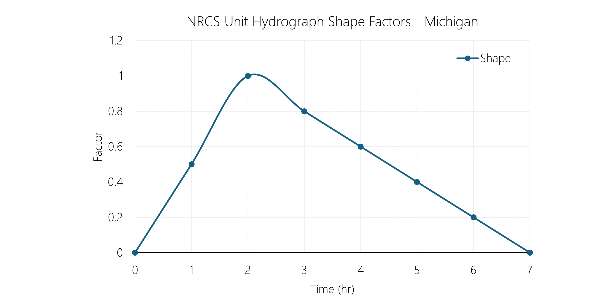
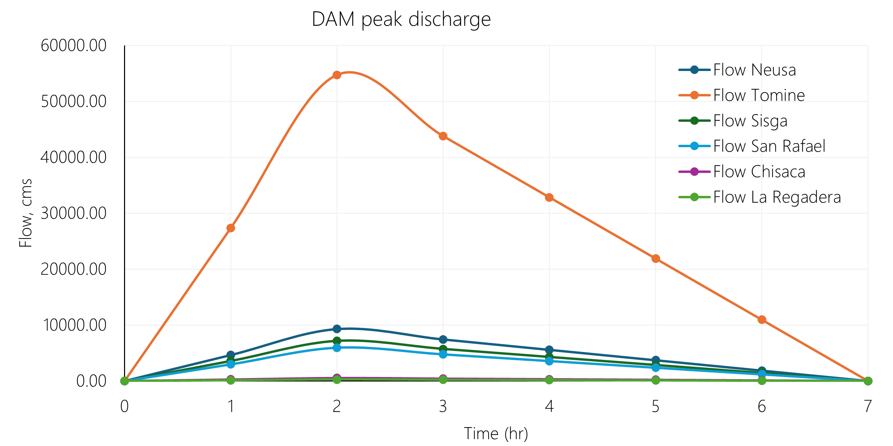

# Modelos HEC-RAS

## Versión v0 - Prototipo funcional (Model0)

Características del modelo

* Sistema internacional de unidades - SI.
* Modelación bidimensional (2D) de canales a superficie libre por descarga súbita en los embalses: Neusa, Tominé, Sisga, San Rafael, Chisacá y La Regadera. En los hidrogramas se han incluído los caudales medios descargados en cada cuerpo, antes y después de las descargas súbitas.
* 

> Para evitar errores en la representación y almacenamiento de los elementos del modelo hidráulica, se han reemplazado u omitido las tildes, eñes y caracteres especiales, por caracteres compatibles con el idioma inglés.

### Archivos componentes del modelo

| Elemento      | Archivo         | Nombre             | 
|:--------------|:----------------|:-------------------|
| Proyecto      | HECRAS25899.prj | HECRAS25899        |
| Plan          | HECRAS25899.p02 | Model0Plan         |
| Geometría     | HECRAS25899.g06 | Model0Geometry     |
| Unsteady flow | HECRAS25899.u01 | Model0UnsteadyFlow |

### Mallado

| Característica           | Characteristic      | Valor     |
|:-------------------------|:--------------------|:----------|
| Tamaño general de celda  | Main cell size      | 240 m     |
| Número de celdas         | Number of Cells     | 123708    |
| Largo promedio por cara  | Average Face Length | 219 m     |
| Tamaño promedio de celda | Average Cell Size   | 47902 m²  |
| Tamaño máximo de celda   | Maximum Cell Size   | 136618 m² |
| Tamaño mínimo de celda   | Minimum Cell Size   | 79 m²     |

### Tiempos de cómputo - Computational interval

El intervalo computacional de tiempo ha definido adaptativo utilizando la condición de Courant a partir de la velocidad entre el largo promedio de las celdas del mallado.

### Hidrograma unitario - Unit Hydrograph UH

Para la distribución del volúmen almacenado y descargado súbitamente desde cada embalse, se han utilizado los factores del hidrograma unitario de la [Natural Resources Conservation Service NRCS del U.S. Department of Agriculture](https://www.nrcs.usda.gov/) de los Estados Unidos de América, correspondiente al hidrograma ajustado utilizado en el estado de Michigan. Se han distribuido los puntos horarios para una duración total de 8 horas.

Mas información en https://learn.hydrologystudio.com/hydrology-studio/knowledge-base/nrcs-unit-hydrograph-peak-factors/

> Los valores del hidrograma unitario de la NRCS han sido utilizados en la primera versión del modelo hidráulico, en futuras versiones de este estudio, se realizará un análisis extendido de diferentes patrones de distribución aplicables a cada embalse.

NRCS Unit Hydrograph Shape Factors - Michigan

| Pulso | Factor |
|-------|--------|
| 0     | 0      |
| 1     | 0.5    |
| 2     | 1      |
| 3     | 0.8    |
| 4     | 0.6    |
| 5     | 0.4    |
| 6     | 0.2    |
| 7     | 0      |

> Para obtener el total del volúmen descargado en cada embalse, se ha estimado (función objetivo en Microsoft Excel) un factor de distribución de 0.285714285714286.

### Hidrogramas y caudales pico en Embalses por descarga súbita

| Google                                                                      | Cuerpo de agua (wiki)                                                                                   | Condición de frontera    | Capacidad (Hm³) | Pico máximo de flujo (m³/s) |
|:----------------------------------------------------------------------------|:--------------------------------------------------------------------------------------------------------|--------------------------|-----------------|-----------------------------|
| [:globe_with_meridians:](http://maps.google.com/maps?q=5.135924,-73.969663) | [Embalse Neusa](https://es.wikipedia.org/wiki/Embalse_del_Neusa)                                        | BC Upstream Neusa        | 117             | 9285.71                     |
| [:globe_with_meridians:](http://maps.google.com/maps?q=5.036403,-73.811914) | [Embalse Tominé](https://es.wikipedia.org/wiki/Embalse_de_Tomin%C3%A9)                                  | BC Upstream Tomine       | 689.5           | 54722.22                    |
| [:globe_with_meridians:](http://maps.google.com/maps?q=5.083958,-73.72756)  | [Embalse Sisga](https://es.wikipedia.org/wiki/Represa_del_Sisga)                                        | BC Upstream Sisga        | 90.1            | 7150.79                     |
| [:globe_with_meridians:](http://maps.google.com/maps?q=4.703225,-73.985746) | [Embalse San Rafael ](https://es.wikipedia.org/wiki/Embalse_de_San_Rafael)                              | BC Upstream San Rafael   | 75              | 5952.38                     |
| [:globe_with_meridians:](http://maps.google.com/maps?q=4.384184,-74.167766) | [Embalse Chisacá](https://www.banrepcultural.org/coleccion-bibliografica/especiales/embalse-de-chisaca) | BC Upstream Chisaca      | 6.7             | 531.75                      |
| [:globe_with_meridians:](http://maps.google.com/maps?q=4.403117,-74.143296) | [Embalse La Regadera](https://archivobogota.secretariageneral.gov.co/noticias/embalse-la-regadera)      | BC Upstream La Regadera  | 3.3             | 261.90                      |

Hidrogramas de descarga súbita por rompimiento de cada embalse

  

