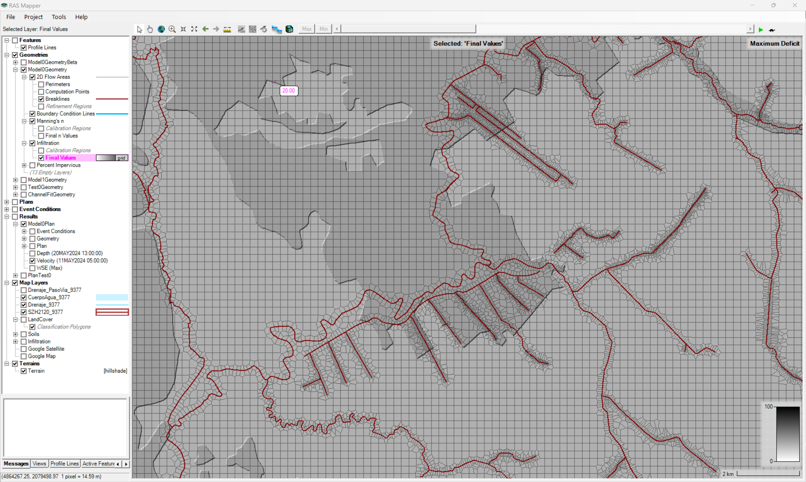
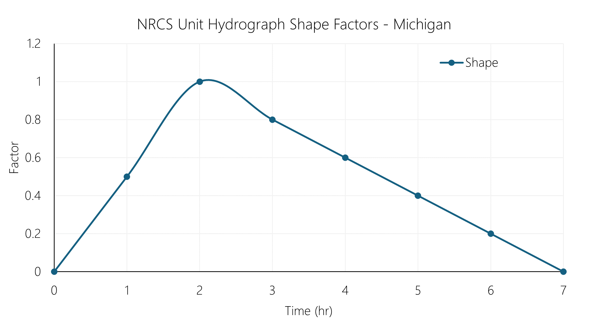
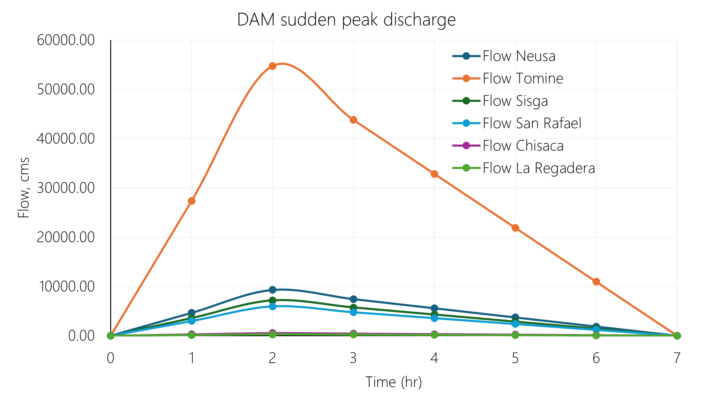
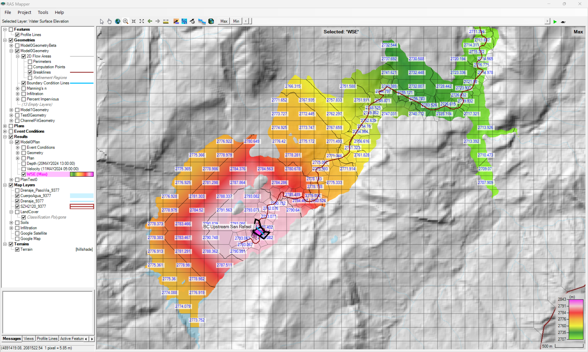
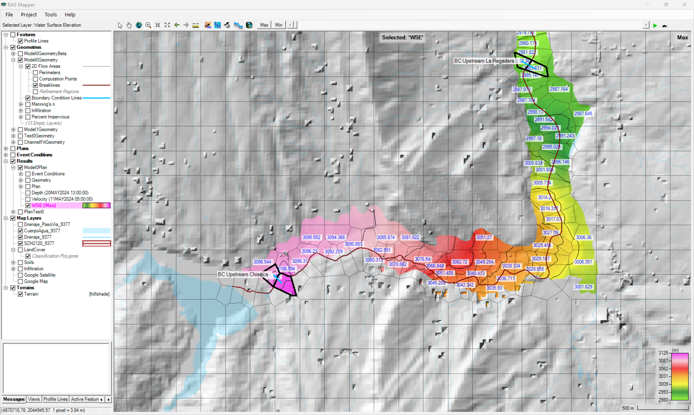

# Modelos HEC-RAS

## 1. Modelo Versión v0 - Prototipo funcional (Model0)

### 1.1. Características generales del modelo

* Sistema internacional de unidades - SI.
* Modelación bidimensional con cobertura de toda la cuenca del Río Bogotá a partir del límite geográfico de la Subzona Hidrográfica SZH 2120 del IDEAM.
* Modelo de terreno híbrido combinando el modelo digital de superficie DSM Copernicus (30m), Lidar extendido 2020 de Bogotá (0.5m), Construcciones Bogotá (0.5m) y canales abiertos en pasos de vía (0.5m).
* Refinamiento de mallado a partir de los alineamientos de cauces principales en toda la cuenca.
* Modelación bidimensional (2D) de canales a superficie libre de toda la cuenca del Río Bogotá por descarga súbita en los embalses: Neusa, Tominé, Sisga, San Rafael, Chisacá y La Regadera. En los hidrogramas se han incluído los caudales medios descargados en cada cuerpo, antes y después de las descargas súbitas. Pulsos en hidrogramas cada 1 hora y resultados cada 30 minutos.
* Esta versión no incluye la modelación de pasos de vía como estructura hidráulica 1D. El flujo es transitado en canales a superficie libre.
* Modelo prototipo sin calibración.
* Modelación de infiltración. No modelación de lluvia directa sobre celdas ni cargas de viento.
* En esta versión no se considera el ajuste de los fondos Lidar (a partir de planos de ingeniería de detalle o utilizando levantamientos topo-batimétricos) en canales debidas al transporte regular del flujo, considerando que ante eventos extremos, la fracción correspondiente al volúmen ya transportado, reduce su capacidad hidráulica.

> Para evitar errores en la representación y almacenamiento de los elementos del modelo hidráulica, se han reemplazado u omitido las tildes, eñes y caracteres especiales, por caracteres compatibles con el idioma inglés.

### 1.2. Archivos componentes del modelo

La creación de proyectos en HEC-RAS usando RAS Mapper requiere de los siguientes archivos:

| Elemento                            | Archivo                              | Nombre             | 
|:------------------------------------|:-------------------------------------|:-------------------|
| Proyecto                            | HECRAS25899.prj                      | HECRAS25899        |
| Plan                                | HECRAS25899.p02                      | Model0Plan         |
| Geometría                           | HECRAS25899.g06                      | Model0Geometry     |
| Unsteady flow                       | HECRAS25899.u01                      | Model0UnsteadyFlow |
| Modelo digital hibrido de terreno   | Terrain/Terrain.hdf                  | Terrain            |
| Mapa de usos o coberturas del suelo | Land Classification/LandCover.hdf    | LandCover          |
| Mapa de suelos                      | Land Classification/Soils.hdf        | Soils              |
| Mapa de infiltración                | Land Classification/Infiltration.hdf | Infiltration       |

 Ventana principal de proyecto  

> Para conocer el detalle del modelo de terreno híbrido ensamblado, consulte la documentación disponible en [.dem](../.dem/Readme.md)
>
> Para conocer el detalle de los mapas de usos, suelos, infiltración, impermeabilidad y sus homologaciones, consulte la documentación disponible en [.shp](../.shp/Readme.md)

### 1.3 Mallado y mapas asociados

El mallado ha sido refinado utilizando los alineamientos de los cauces principales de la red de drenaje de la cuenca contenidos en [Breakline_9377_v0.shp](../.shp/Breakline_9377_v0.rar). Para mayor información, consulte la documentación disponible de _Breaklines_ en la carpeta [.shp](../.shp/Readme.md)

| Característica                                | Characteristic      | Valor     |
|:----------------------------------------------|:--------------------|:----------|
| Coeficiente de rugosidad global de Manning    | Manning's n         | 0.030     |
| Tolerancia en longitud de caras               | Cell tolerance      | 5 %       |
| Tamaño general de celda horizontal y vertical | Main cell size      | 240 m     |
| Número de celdas                              | Number of Cells     | 123708    |
| Largo promedio por cara                       | Average Face Length | 219 m     |
| Tamaño promedio de celda                      | Average Cell Size   | 47902 m²  |
| Tamaño máximo de celda                        | Maximum Cell Size   | 136618 m² |
| Tamaño mínimo de celda                        | Minimum Cell Size   | 79 m²     |

 2D Flow Area  

> El valor global definido de Coeficiente de Rugosidad de Manning, únicamente es aplicable a celdas en la que no exista cobertura en el mapa de usos del suelo. Para este estudio se ha definido un mapa global con cobertura sobre todo el Departamento de Cundinamarca y la cuenca del Río Bogotá.

 Mapa de rugosidad de Manning  

> El valor de tolerancia de longitud de celda se define en RAS Mapper desde el menú _Tools / Options… / Mesh Tolerances / Maximum Face Length Tolerance (Percent)_. De acuerdo a las recomendaciones del manual técnico de HEC-RAS, en modelos cuyo propósito es también la modelación de sedimentos, el porcentaje de tolerancia debe ser definido al rededor del 15%, sin embargo, al realizar pruebas de mallado se pudo observar que para la topología de la red que combina diferentes tipos de ancho de sección, la definición de este porcentaje generaba celdas triangulares con terminaciones muy alargadas y con traslapo sobre otras celdas.

 Mesh Tolerances  

 Infiltration  

 Percent impervious  

### 1.4. Tiempos de cómputo - Computational interval

El intervalo computacional de modelación se ha definido adaptativo utilizando la condición de Courant y la metodología que utiliza la relación de la velocidad en las caras entre el largo promedio de las celdas del mallado _(Velocity/Length o Face velocity * dt / cell to cell distance)_.

> El valor máximo de velocidad ha sido asumido y requiere de investigation complementaria.

 Tomado de: <a href="https://www.hec.usace.army.mil/confluence/rasdocs/ras1dtechref/latest/performing-a-dam-break-study-with-hec-ras/computational-time-step">Manual de Referencia Hidráulica de HEC-RAS</a>  

| Parámetro                                            | Valor                 |
|:-----------------------------------------------------|:----------------------|
| Velocidad máxima del flujo o celeridad de onda       | 60.83 m/s             |
| Velocidad mínima del flujo o celeridad de onda       | 0.001 m/s             |
| ΔT, intervalo computacional de cómputo               | 1800 seg (30 minutos) |
| ΔX, distancia promedio entre celdas                  | 219 m                 |
| Máximo valor del número de Courant (C = V * ΔT / ΔX) | 500                   |
| Mínimo valor del número de Courant (C = V * ΔT / ΔX) | 0.00821918            |

 Advanced Time Step Control  

### 1.5. Hidrogramas

#### 1.5.1. Hidrograma unitario - Unit Hydrograph UH

Para la distribución del volúmen almacenado y descargado súbitamente desde cada embalse, se han utilizado los factores del hidrograma unitario de la [Natural Resources Conservation Service NRCS del U.S. Department of Agriculture](https://www.nrcs.usda.gov/) de los Estados Unidos de América, correspondiente al hidrograma ajustado utilizado en el estado de Michigan. Se han distribuido los puntos horarios para una duración total de 8 horas.

Mas información en https://learn.hydrologystudio.com/hydrology-studio/knowledge-base/nrcs-unit-hydrograph-peak-factors/

> Los valores del hidrograma unitario de la NRCS han sido utilizados en la primera versión del modelo hidráulico, en futuras versiones de este estudio, se realizará un análisis extendido de diferentes patrones de distribución aplicables a cada embalse.

NRCS Unit Hydrograph Shape Factors - Michigan

| Pulso | Factor |
|-------|--------|
| 0     | 0      |
| 1     | 0.5    |
| 2     | 1      |
| 3     | 0.8    |
| 4     | 0.6    |
| 5     | 0.4    |
| 6     | 0.2    |
| 7     | 0      |

  

> Para obtener el total del volúmen descargado en cada embalse, se ha estimado (función objetivo en Microsoft Excel) un factor de distribución de 0.285714285714286.

#### 1.5.2. Hidrogramas y caudales pico en Embalses por descarga súbita - Condiciones de frontera

Las líneas de condición de frontera han sido trazadas aguas abajo de la pantalla de cada presa.

| Google                                                                      | Cuerpo de agua (wiki)                                                                                   | Condición de frontera    | Capacidad (Hm³) | Pico máximo de flujo (m³/s) |
|:----------------------------------------------------------------------------|:--------------------------------------------------------------------------------------------------------|--------------------------|-----------------|-----------------------------|
| [:globe_with_meridians:](http://maps.google.com/maps?q=5.135924,-73.969663) | [Embalse Neusa](https://es.wikipedia.org/wiki/Embalse_del_Neusa)                                        | BC Upstream Neusa        | 117             | 9285.71                     |
| [:globe_with_meridians:](http://maps.google.com/maps?q=5.036403,-73.811914) | [Embalse Tominé](https://es.wikipedia.org/wiki/Embalse_de_Tomin%C3%A9)                                  | BC Upstream Tomine       | 689.5           | 54722.22                    |
| [:globe_with_meridians:](http://maps.google.com/maps?q=5.083958,-73.72756)  | [Embalse Sisga](https://es.wikipedia.org/wiki/Represa_del_Sisga)                                        | BC Upstream Sisga        | 90.1            | 7150.79                     |
| [:globe_with_meridians:](http://maps.google.com/maps?q=4.703225,-73.985746) | [Embalse San Rafael ](https://es.wikipedia.org/wiki/Embalse_de_San_Rafael)                              | BC Upstream San Rafael   | 75              | 5952.38                     |
| [:globe_with_meridians:](http://maps.google.com/maps?q=4.384184,-74.167766) | [Embalse Chisacá](https://www.banrepcultural.org/coleccion-bibliografica/especiales/embalse-de-chisaca) | BC Upstream Chisaca      | 6.7             | 531.75                      |
| [:globe_with_meridians:](http://maps.google.com/maps?q=4.403117,-74.143296) | [Embalse La Regadera](https://archivobogota.secretariageneral.gov.co/noticias/embalse-la-regadera)      | BC Upstream La Regadera  | 3.3             | 261.90                      |

  

 Unsteady Flow Data  

  Unsteady Flow Boundary Files  

### 1.6. Ejecución y resultados

Parámetros generales para cálculo y presentación de resultados 

| Parámetro                  | Valor                           |
|:---------------------------|:--------------------------------|
| Starting date              | 04MAY2024                       |
| Ending date                | 30MAY2024                       |
| Starting time              | 00:00                           |
| Ending time                | 00:23                           |
| Computation interval       | Controlled by Courant condition |
| Mapping output interval    | 30 Minute                       |
| Hydrograph output interval | 30 Minute                       |
| Detailed output interval   | 30 Minute                       |

 2D Flow Options  

 2D Options  

Ventana de ejecución 

#### 1.6.1. Elevación máxima lámina de agua - Water surface elevation - WSE

Elevación máxima de la lámina de agua expresada en metros sobre el nivel del mar (m.s.n.m).

 Maximun Water Surface Elevation - WSE (m.s.n.m)  

 Maximun Water Surface Elevation - WSE (m.s.n.m) - Embalse del Neusa  

 Maximun Water Surface Elevation - WSE (m.s.n.m) - Embalse Tominé  

 Maximun Water Surface Elevation - WSE (m.s.n.m) - Embalse del Sisga  

 Maximun Water Surface Elevation - WSE (m.s.n.m) - Embalse San Rafael  

 Maximun Water Surface Elevation - WSE (m.s.n.m) - Embalse Chisacá y La Regadera  

