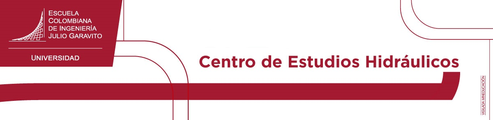
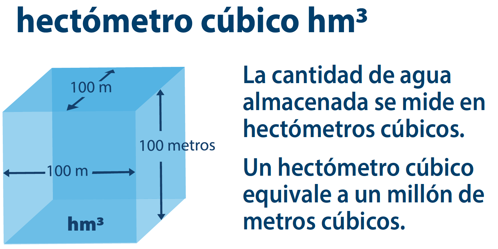
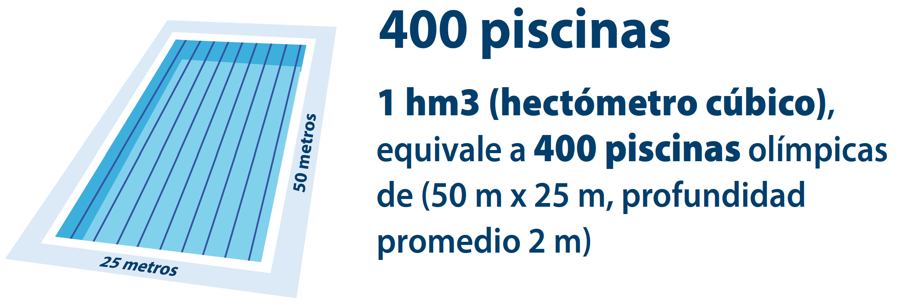

# :clapper:Entrevista en _NODO CIENTÍFICO_ (script)

Hola, bienvenidos a [NODO CIENTÍFICO](https://www.escuelaing.edu.co/es/investigacion-e-innovacion/), el programa del CANAL I+i+e de la [Escuela Colombiana de Ingeniería Julio Garavito](). Hoy tenemos como invitado, a William Ricardo Aguilar Piña, él es Ingeniero Civil, especialista en recursos hidráulicos y medio ambiente y máster en desarrollo urbano y territorial; actualmente se desempeña como profesor e investigador de la Escuela Colombiana de Ingeniería en el Centro de Recursos hidráulicos, y hoy nos viene a hablar del proyecto de investigación **_Hydro-Bogotá_**.

Bienvenido, ingeniero.

Gracias Esperanza por haberme extendido esta invitación y por tenerme aquí en Nodo Científico.

## 1. Háblenos en primer de que se trata este proyecto de investigación y ¿de dónde surgió esta idea?

Hydro-Bogotá, es un proyecto de investigación colaborativa que busca integrar y generar conocimiento científico alrededor del estudio del ciclo hidrológico y su asociación con los fenómenos físicos producidos por la escorrentía en la cuenca hidrográfica del Río Bogotá.

 Cuenca Río Bogotá y sistema de embalses. Tomado de: Elaboración propia.
 

Esta cuenca tiene un área aproximada de 5926 km² y es particularmente interesante su estudio, debido a que en ella se encuentran varias cabeceras municipales, se desarrollan diferentes actividades socioeconómicas y porque es donde está ubicada la ciudad de Bogotá; también porque cuenta internamente con 6 embalses reguladores en zonas altas (Tominé, Neusa, Sisga, San Rafael, Chisacá y La Regadera), que tienen una superficie aproximada de 48 km² y almacenan más de 980 hm³ de agua.

 Cuenca Río Bogotá y sistema de embalses zona norte: Tominé, Neusa y Sisga. Tomado de: Elaboración propia.
  

 Cuenca Río Bogotá y sistema de embalses zona centro y sur: San Rafael, Chisacá y La Regadera. Tomado de: Elaboración propia.
 

Para darnos una idea de la magnitud del modelo computacional que estamos construyendo, y de los embalses que vamos a incluir en la modelación hidráulica, pensemos en el tamaño de una piscina olímpica (que tiene más o menos 50m x 25m x 2m de profundidad = 2500m³), entonces, 1 solo hectómetro cúbico (100 x 100 x 100m) puede ser algo así como 400 piscinas olímpicas[^1]. Ahora imaginemos tener 392mil piscinas olímpicas en la parte alta de una montaña y que de repente estas se desocupen sobre la llanura del Río Bogotá.

 Hectómetro cúbico. Tomado de: Consumo diario de agua, Canal de Panamá.
  

 Equivalente de hectómetro cúbico en número de piscinas olímpicas. Tomado de: Consumo diario de agua, Canal de Panamá.
 

Con respecto a de donde surgió esta idea, en alguna ocasión me preguntaron, **_“Ingeniero, que pasaría si por un fenómeno sísmico de gran magnitud, colapsaran súbitamente los embalses que existen en esta cuenca, qué cabeceras municipales podrían verse afectadas y si tendríamos suficiente tiempo para desplazarnos a zonas altas y resguardarnos de la inundación”_**. En ese momento me pregunté, si con los conocimientos, experticia, recursos humanos y tecnológicos que tenemos en el [Centro de Estudios Hidráulicos de la Escuela](https://www.escuelaing.edu.co/es/investigacion-e-innovacion/centro-de-estudios-hidraulicos/), podríamos crear un modelo computacional que nos permitiera estudiar ese tipo de eventos, y de ahí surgió esta investigación.

> Investigando este tema, encontramos que en todo el mundo han ocurrido múltiples eventos relacionados con el fallo o colapso de represas, muchos de esos casos de estudio se encuentran documentados en un sitio web muy interesante, llamado https://damfailures.org/, los invito para que exploren su contenido.

 Lecciones aprendidas de incidentes y fallos en represas. Tomado de: https://damfailures.org/.

## 2. Ingeniero Aguilar, ¿A qué se refiere con “investigación colaborativa”, cuando hablamos de este proyecto? 

Hydro-Bogotá es un proyecto abierto y continuo, en el que pueden participar estudiantes, ingenieros, especialistas, semilleros, centros de estudios, universidades, entidades gubernamentales, ONG, empresas de servicios públicos y la sociedad civil en general; y es colaborativo, por qué busca integrar todo su conocimiento y experticia en un interés general, que es conocer y entender las dinámicas que ocurren en la cuenca del Río Bogotá, alrededor del estudio del agua.

Esperanza, este no solamente es un proyecto pensado para que participen ingenieros en recursos hidráulicos, también se requiere del conocimiento experto de otras profesiones afines, tales como:

* Ingenieros ambientales
* Ingenieros geotécnicos
* Ingenieros estructurales
* Ingenieros topográficos

## 3. Ingeniero, veo que este es un proyecto con un alcance muy extenso ¿Ha sido concebido para que se pueda desarrollar por etapas y de donde se obtendrá toda la información requerida?

Así es Esperanza, este proyecto por su extensión y dinámica, ha sido concebido para ser desarrollado en 3 horizontes:

### Horizonte 1 - Corto plazo

En el corto plazo que ya ha sido desarrollado, se creó un prototipo hidráulico 2D funcional en HEC-RAS de toda la cuenca del Río Bogotá. Para la modelación de la descarga súbita simultánea de todos los embalses, y para realizar este modelo, fue necesario:

**a.** Integrar modelos digitales de elevación de diferentes fuentes en un único modelo híbrido; esto ha sido un desafío, no solamente por su extensión espacial, sino por la variedad de resoluciones o precisiones que estos manejan. Por una parte, tenemos el modelo digital Copernicus de la Agencia Espacial de europea - ESA, cuya resolución es de 30 metros y cubre toda la cuenca, los levantamientos Lidar de Bogotá disponibles en IDECA con resolución de entre 0.5 y 5 metros, y los bloques de obstrucción generados a partir de construcciones.

 Modelo digital híbrido de elevación, vista en planta. Tomado de: Elaboración propia.
  

 Modelo digital híbrido de elevación, vista 3D. Tomado de: Elaboración propia.
  

<a href="video/DEM_EmbalsesSistemaSur.md" target="_blank"> :clapper:Animación en video - Embalse Chisacá y la Regadera.</a>

<a href="video/DEM_Integrado_1920.mp4" target="_blank">:clapper:Animación en video para incorporación en entrevista: Modelo digital híbrido de elevación, visualización 3D general y por zonas. Tomado de: Elaboración propia.</a>
  

**b.** Otro elemento importante por considerar, son las intersecciones de los ríos y/o canales con pasos de vía, en estos lugares existen puentes y alcantarillas que deben ser incorporadas o ajustadas en el modelo. Las identificamos, y solo en Bogotá hay 310 pasos de vía, de los cuales 217 requirieron de ajuste en el modelo de terreno.

 Pasos de vía identificados en la ciudad de Bogotá. Tomado de: Elaboración propia.
  

 Ajuste de pasos de vía. Tomado de: Elaboración propia.
  

 Ajuste de pasos de vía en Canal Molinos. Tomado de: Elaboración propia.
  

**c.** Algo también muy importante, ha sido la complementación y ajuste de la red de drenaje con el nivel de detalle que esta requiere, no solamente en sus ejes, sino también en las coronas y en las líneas de transferencia para ajustar el mallado de la superficie 3D. Digitalizamos 54 km de drenajes principales faltantes y 1614 km de líneas de banca y líneas de transición de mallado, todo a escala 1:1000 o inferior.

 Digitalización de drenajes, coronas y líneas de transición. Tomado de: Elaboración propia.
  

[^1]: https://pancanal.com/wp-content/uploads/2023/12/Consumo-Diario-AC-1.pdf