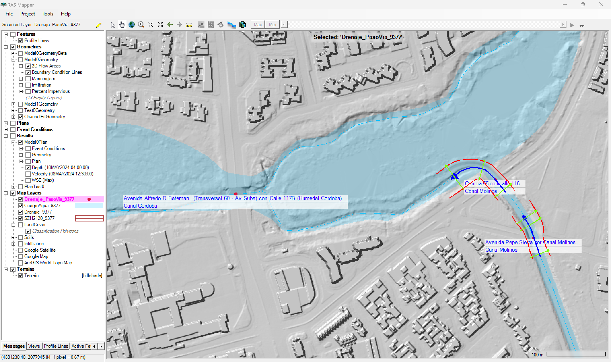

# :clapper:Entrevista en _NODO CIENTÍFICO_ (script)

 

Hola, bienvenidos a [NODO CIENTÍFICO](https://www.escuelaing.edu.co/es/investigacion-e-innovacion/), el programa del CANAL **_[I+i+e](https://www.youtube.com/c/CanalImasi)_** de la [Universidad Escuela Colombiana de Ingeniería Julio Garavito](). Hoy tenemos como invitado, a William Ricardo Aguilar Piña, él es Ingeniero Civil, especialista en recursos hidráulicos y medio ambiente y máster en desarrollo urbano y territorial; actualmente se desempeña como profesor e investigador de la Escuela Colombiana de Ingeniería en el Centro de Recursos hidráulicos, y hoy nos viene a hablar del proyecto de investigación **_Hydro-Bogotá_**.

Bienvenido, ingeniero.

Gracias Esperanza por haberme extendido esta invitación y por tenerme aquí en Nodo Científico.

## 1. Háblenos en primer de que se trata este proyecto de investigación y ¿de dónde surgió esta idea?

Hydro-Bogotá, es un proyecto de investigación colaborativa que busca integrar y generar conocimiento científico alrededor del estudio del ciclo hidrológico y su asociación con los fenómenos físicos producidos por la escorrentía en la cuenca hidrográfica del Río Bogotá.

 Cuenca Río Bogotá y sistema de embalses.
 

Esta cuenca tiene un área planar aproximada de 5926 km² y es particularmente interesante su estudio, debido a que en ella se encuentran varias cabeceras municipales, se desarrollan diferentes actividades socioeconómicas y porque es donde está ubicada la ciudad de Bogotá; también porque cuenta internamente con 6 embalses reguladores en zonas altas (Tominé, Neusa, Sisga, San Rafael, Chisacá y La Regadera), que tienen una superficie aproximada de 48 km² y almacenan más de 980 hm³ de agua.

 Cuenca Río Bogotá y sistema de embalses zona norte: Tominé, Neusa y Sisga.
  

 Cuenca Río Bogotá y sistema de embalses zona centro y sur: San Rafael, Chisacá y La Regadera.
 

Para darnos una idea de la magnitud del modelo computacional que estamos construyendo, y de los embalses que vamos a incluir en la modelación hidráulica, pensemos en el tamaño de una piscina olímpica (que tiene más o menos 50m x 25m x 2m de profundidad = 2500m³), entonces, 1 solo hectómetro cúbico (100 x 100 x 100m) puede ser algo así como 400 piscinas olímpicas[^1]. Ahora imaginemos tener 392mil piscinas olímpicas en la parte alta de una montaña y que de repente estas se desocupen sobre la llanura del Río Bogotá.

 Equivalente de hectómetro cúbico en número de piscinas olímpicas. Tomado de: Consumo diario de agua, Canal de Panamá.
 

Con respecto a de donde surgió esta idea, en alguna ocasión me preguntaron, **_“Ingeniero, que pasaría si por un fenómeno sísmico de gran magnitud, colapsaran súbitamente los embalses que existen en esta cuenca, qué cabeceras municipales podrían verse afectadas y si tendríamos suficiente tiempo para desplazarnos a zonas altas y resguardarnos de la inundación”_**. En ese momento me pregunté, si con los conocimientos, experticia, recursos humanos y tecnológicos que tenemos en el [Centro de Estudios Hidráulicos de la Escuela](https://www.escuelaing.edu.co/es/investigacion-e-innovacion/centro-de-estudios-hidraulicos/), podríamos crear un modelo computacional que nos permitiera estudiar ese tipo de eventos, y de ahí surgió esta investigación.

 California DWR - Represa Orosville U.S. & ABC News - Fallo The Rapid Dam en Blue County U.S. Tomado de: California DWR y ABC News

<a href="video/DAM_Failure.md" target="_blank">:clapper:Animación en video para incorporación en entrevista.</a>
 

> Investigando este tema, encontramos que en todo el mundo han ocurrido múltiples eventos relacionados con el fallo o colapso de represas, muchos de esos casos de estudio se encuentran documentados en un sitio web muy interesante, llamado https://damfailures.org/, los invito para que exploren su contenido. [^2]

 Lecciones aprendidas de incidentes y fallos en represas. Tomado de: https://damfailures.org/.

## 2. Ingeniero Aguilar, ¿A qué se refiere con “investigación colaborativa”, cuando hablamos de este proyecto? 

Hydro-Bogotá es un proyecto abierto y continuo, en el que pueden participar estudiantes, ingenieros, especialistas, semilleros, centros de estudios, universidades, entidades gubernamentales, ONG, empresas de servicios públicos y la sociedad civil en general; y es colaborativo, por qué busca integrar todo su conocimiento y experticia en un interés general, que es conocer y entender las dinámicas que ocurren en la cuenca del Río Bogotá, alrededor del estudio del agua.

Esperanza, este no solamente es un proyecto pensado para que participen ingenieros en recursos hidráulicos, también se requiere del conocimiento experto de otras profesiones afines, tales como:

* Ingenieros ambientales
* Ingenieros geotécnicos
* Ingenieros estructurales
* Ingenieros topográficos

## 3. Ingeniero, veo que este es un proyecto con un alcance muy extenso ¿Ha sido concebido para que se pueda desarrollar por etapas y de donde se obtendrá toda la información requerida?

Así es Esperanza, este proyecto por su extensión y dinámica, ha sido concebido para ser desarrollado en 3 horizontes:

### Horizonte 1 - Corto plazo

En el corto plazo que ya ha sido ejecutado, se creó un prototipo hidráulico 2D funcional en [HEC-RAS](https://www.hec.usace.army.mil/software/hec-ras/), para la modelación de la descarga súbita simultánea de todos los embalses de la cuenca del Río Bogotá, y para realizar este modelo, fue necesario:

**A.** Integrar modelos digitales de elevación de diferentes fuentes en un único modelo híbrido; esto ha sido un desafío, no solamente por su extensión espacial, sino por la variedad de resoluciones o precisiones que estos manejan. Por una parte, tenemos el modelo digital Copernicus de la Agencia Espacial Europea - ESA, cuya resolución es de 30 metros y cubre toda la cuenca, los levantamientos Lidar de Bogotá disponibles en IDECA con resolución de entre 0.5 y 5 metros, y los bloques de obstrucción generados a partir de construcciones en 0.5 metros.

 Modelo digital híbrido de elevación, vista en planta.
  

 Modelo digital híbrido de elevación, vista 3D.

<a href="video/DEM_EmbalsesSur.md" target="_blank">:clapper:Animación en video.</a>

<a href="video/DEM_Integrado_1920.mp4" target="_blank">:clapper:Animación en video para incorporación en entrevista.</a>
  

**B.** Otro elemento importante por considerar, son las intersecciones de los ríos y/o canales con pasos de vía, en estos lugares existen puentes y alcantarillas que deben ser incorporadas o ajustadas en el modelo. Las identificamos, y solo en Bogotá hay 310 pasos de vía, de los cuales 217 requirieron de ajuste en el modelo de terreno.

 Pasos de vía identificados en la ciudad de Bogotá.
  

 Ajuste de pasos de vía.
  

 Ajuste de pasos de vía en Canal Molinos.
  

**C.** Algo también muy importante, ha sido la complementación y ajuste de la red de drenaje con el nivel de detalle que esta requiere, no solamente en sus ejes, sino también en las coronas y en las líneas de transferencia para ajustar el mallado de la superficie 3D. Digitalizamos 54 km de drenajes principales faltantes y 1614 km de líneas de banca y líneas de transición de mallado, todo a escala 1:1000 o inferior.

 Digitalización de drenajes, coronas y líneas de transición.
  

**D.** Otro aspecto fue la homologación de los mapas de suelos y coberturas por uso de todo el Departamento de Cundinamarca, esto para poder definir los grupos hidrológicos, establecer tasas de infiltración, definir los valores iniciales de rugosidad y los porcentajes de impermeabilidad en las zonas urbanas.

 Suelos con asociación de grupos hidrológicos y tasas de infiltración.
  

 Usos del suelo, rugosidades de Manning y porcentajes de impermeabilidad.
  

**E.** Finalmente, en este corto plazo se realizó la creación del prototipo de simulación 2D incluyendo todos estos elementos, y evaluando el tránsito hidráulico en 124 mil celdas (con un tamaño aproximado de 79 m² por celda) con la incorporación de los ejes de cauces principales como breaklines en el refinamiento del mallado, en una longitud de 906 kilómetros.

 Mallado y refinamiento en prototipo a partir de ejes.
 

### ¿Y como en todo importante proyecto de esta magnitud, vienen más etapas?.

Sí Esperanza.

### Horizonte 2 - Mediano plazo

Para el mediano plazo, se ha planteado el ajuste detallado de los mapas de suelos y usos, la incorporación de información Lidar o de alto detalle topográfico en zonas estratégicas del modelo (como la descarga hacia el Salto del Tequendama y corredores de drenaje en cauces principales fuera de la ciudad de Bogotá), el refinamiento del mallado, la calibración del modelo, la inclusión de estructuras hidráulicas, la modelación de eventos extremos para diferentes periodos de recurrencia y la generación de mapas de amenazas.

 Zona Embalse del Muña hacia el Salto del Tequendama.
 

 Refinamiento de mallado incluyendo coronas y líneas de transición.
 

### Horizonte 3 - Largo plazo

Para el largo plazo, se ha planteado el ajuste de secciones en canales a partir de levantamientos topo-batimétricos, la simulación hidráulica general en otras herramientas (como [Iber](https://imasgal.com/que-es-iber) y [Mike](https://www.dhigroup.com/technologies/mikepoweredbydhi/mikeplus-rivers)) y su comparación con los resultados obtenidos en [HEC-RAS](https://www.hec.usace.army.mil/software/hec-ras/), la simulación detallada de rompimiento de represas, la simulación de sedimentos, la simulación no Newtoniana considerando la mezcla del agua con el suelo y otros materiales, y la operación de los embalses.

 HEC-RAS vs. Iber vs. Mike. Tomado de: íconos oficiales de aplicaciones (ajustados a B/N).
 

## 4. Hablando un poco de esos modelos y de lo que ya se realizó a corto plazo, ¿Qué resultados obtuvieron?

Esperanza, hemos encontrado preliminarmente resultados muy interesantes, si bien, este es un prototipo, hemos podido identificar lo siguiente:

**A.** Una vez se desarrolla completamente el flujo de descarga súbita de cada embalse y este llega y fluye lateralmente por la planicie de la llanura de inundación, puede alcanzar velocidades de hasta 1 m/s y frentes de onda u olas de hasta 10 o más metros de altura en algunas zonas.

 Frente de onda de inundación proveniente de Tominé, Neusa y Sisga .

<a href="video/Model0_Results_Depth1.md" target="_blank">:clapper:Animación en video para incorporación en entrevista.</a>
 

**B.** Las descargas provenientes del Embalse del Neusa y las combinadas provenientes de los Embalses Tominé y Sisga, viajan casi a la misma velocidad hasta encontrarse cerca al Embalse de Aposentos en el Municipio de Sopó, esto a pesar de que la llanura inundable del Río Bogotá es más amplia en el corredor de descarga del Tominé y que los volúmenes descargados son mayores.

 Velocidad de onda de inundación – Zona Tominé, Neusa y Sisga.

<a href="video/Model0_Results_Velocity1.md" target="_blank">:clapper:Animación en video para incorporación en entrevista.</a>
 

**C.** Las descargas súbitas y flujos que vienen del Embalse San Rafael se encuentran con las que vienen del Embalse de Tominé, justo en la zona de llanura baja, cerca de la cabecera municipal del Municipio de Sopó. El flujo y su desplazamiento es dominado por las descargas del Tominé.

 Encuentro de ondas de inundación Tominé a San Rafael.

<a href="video/Model0_Results_Velocity2.md" target="_blank">:clapper:Animación en video para incorporación en entrevista.</a>
 

### ¿Y el flujo proveniente desde los embalses del norte (Tominé, Neusa, Sisga y San Rafael)?

Sí, en el punto...

**D.** Todo el flujo proveniente desde los embalses del norte (Tominé, Neusa, Sisga y San Rafael), ingresa a Bogotá por la garganta que genera el sistema montañoso del Río Bogotá y Río Frío; al llegar al área urbana, este se bifurca por la formación de los Cerros de Suba, y parte se descarga en contraflujo por el canal Guaymaral hasta que el frente de onda pasa, luego, el sentido del flujo se invierte hacia el Río Bogotá hasta drenar la inundación producida.

 Velocidad de onda de inundación y bifurcación del flujo ingresando a la ciudad de Bogotá.

<a href="video/Model0_Results_Velocity3.md" target="_blank">:clapper:Animación en video para incorporación en entrevista.</a>
 

**E.** El flujo de descarga proveniente desde los embalses Chisacá y La Regadera, es drenado o amortiguado en la llanura, antes de que los flujos provenientes del sistema norte llegan al área urbana de Bogotá.

 Flujo drenado sistema sur desde Chisacá y La Regadera.

<a href="video/Model0_Results_Depth2.md" target="_blank">:clapper:Animación en video.</a>

<a href="video/Model0_Results_Depth2_3840.mp4" target="_blank">:clapper:Animación en video para incorporación en entrevista.</a>
 

**F.** Luego de la inundación, gran parte de los flujos de excesos que se descargan sobre los humedales y canales de la ciudad de Bogotá son drenados hasta volver casi a su estado regular. Sin embargo, la zona de descarga del embalse del Muña hasta el Santo del Tequendama no dispone actualmente de información Lidar de alta precisión, para poder simular completamente la descarga y vaciado de la llanura inundable remanente. Es por ello por lo que, a mediano plazo, se ha propuesto incorporar al modelo digital de elevación híbrido, esta información de detalle.

 Flujo de inundaciones en humedales y zonas bajas de Bogotá.

<a href="video/Model0_Results_Depth3.md" target="_blank">:clapper:Animación en video. </a> 

<a href="video/Model0_Results_Depth3_3840.mp4" target="_blank">:clapper:Animación en video para incorporación en entrevista.</a>
 

## 5. Importante trabajo el que se está desarrollado en la Escuela. Podría, ingeniero Aguilar, explicar brevemente, ¿de qué manera los estudiantes y los demás centros de estudios e interesados pueden participar en este proyecto de investigación?

El proyecto Hydro-Bogotá dispone de un repositorio público en GitHub, allí se encuentra en detalle el contenido de la investigación y los avances realizados, también dispone de los datos fuente y los ensambles generados.

 Hydro-Bogotá en GitHub.
 

> Para conocer más en detalle este proyecto, los interesados en participar en esta iniciativa, desarrollando p. ej., trabajos de grado y estudios de casos particulares, pueden acercarse al Centro de Estudios Hidráulicos de la Escuela Colombiana de Ingeniería.

## 6. Profesor, partiendo de su conocimiento y experiencia, cómo se podría potencializar el ejercicio práctico de estos temas con entidades gubernamentales.

Esperanza, tal vez una buena estrategia pueda ser a través de la divulgación de este proyecto con otras universidades, y con las entidades públicas del distrito y de los municipios que se encuentran en el área de influencia de la cuenca del Río Bogotá.

Seguramente ellos ya cuentan con experiencias particulares sobre estos temas, y los municipios disponen de información topográfica de detalle que necesitamos incorporar en esta investigación. Como hablamos al inicio de la charla, no se trata de que solo en la Escuela mantengamos esta investigación activa, sino que los productos que se obtengan puedan ser utilizados como insumo, p. ej., en la elaboración de los planes de ordenamiento territorial y que creemos esa sinergia que permita que todo este esfuerzo pueda ser aprovechado.

## 7. Ingeniero Aguilar, para ir finalizando esta valiosa entrevista, por favor, nos podría hacer una reflexión del papel de los ingenieros en estos temas, de cara a la responsabilidad ambiental, sostenible y compromiso social. 

Bueno, mi invitación es a qué como ingenieros, divulguemos, participemos y fomentemos el desarrollo de proyectos de investigación de este tipo, que documentemos y compartamos todo nuestro conocimiento y que motivemos a nuestros estudiantes, para qué en el ejercicio de su desarrollo profesional, piensen en que somos parte de un entorno común y que debemos plantear proyectos y soluciones sostenibles a largo plazo.

## 8. Gracias y nos vemos en una próxima oportunidad

Gracias.

> Ilustraciones y videos sin citación de fuente, corresponden a elaboración propia.

[^1]: https://pancanal.com/wp-content/uploads/2023/12/Consumo-Diario-AC-1.pdf
[^2]: https://damfailures.org/case-study/oroville-dam-california-2017/