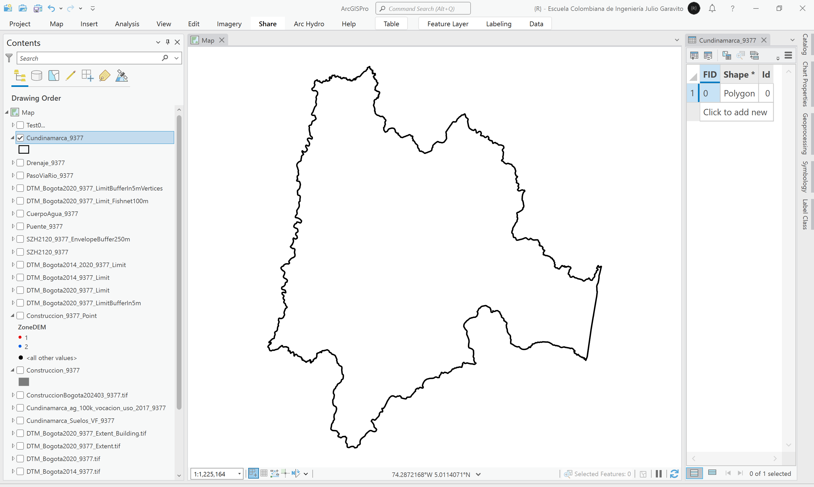
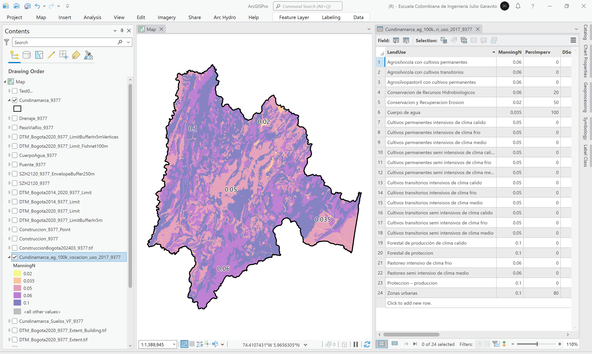

# Capas vectoriales

Esta carpeta contiene los archivos vectoriales o capas shapefile (.shp) procesadas para el ensamble y validación del modelo hidráulico, las cuales han sido re-proyectados al sistema de coordenadas 9377 Magna Orígen Único Nacional de Colombia.

> Para conocer los archivos fuente a partir de los cuales se generaron los diferentes shapefile, diríjase a la sección [.data](../.data) de este repositorio.
> 
> Para incorporar construcciones adicionales de otros municipios, actualización de construcciones existentes o incorporar elementos complementarios en otras capas, es necesario incluir los atributos definidos en el catálogo de objetos de cada capa o clase de entidad.

## Construcciones (polígono y centroide)

Las construcciones son utilizadas como complemento en la creación del modelo de terreno híbrido y son consideradas como bloques de obstrucción del modelo hidráulico; también son utilizadas para el ajuste del mapa general de rugosidades debido a que en las caras de mallado, son requeridos valores altos e impermeabilidades en cero (excepto en construcciones con cubiertas ecológicas o [SUDS](https://www.susdrain.org/delivering-suds/using-suds/background/sustainable-drainage.html)) en este tipo de elementos.

:open_file_folder: Archivo local Construccion_9377.shp en 4 partes: [1](Construccion_9377.part01.rar), [2](Construccion_9377.part02.rar), [3](Construccion_9377.part03.rar), [4](Construccion_9377.part04.rar)  
:open_file_folder: Archivo local de centroides en construcciones: [Construccion_9377_Point.shp](Construccion_9377.rar)

> Para el cálculo correcto de la altura de cada construcción y para generar la grilla de elevaciones, es necesario primero ejecutar el geo-proceso _Multipart to Singlepart Conversion_ que permite separar las entidades multiparte.
> 
> Se han eliminado las edificaciones con áreas inferiores a 1 m².

### Construcciones incorporadas

| Fuente                                                   | Descripción                                                | Entidades |
|----------------------------------------------------------|------------------------------------------------------------|-----------|
| :new: Construcciones Bogotá D.C a 2024.03.03 desde IDECA | Solo construcciones dentro de la subzona hidrográfica 2120 | 2391355   |

### Catálogo de objetos

| Campo      | Definición                                                                  | Tipo   |
|:-----------|-----------------------------------------------------------------------------|--------|
| CONNPISOS  | Número de pisos                                                             | Long   |
| CONTSEMIS  | Semisótano: 1-Sí, 0-No                                                      | Long   |
| ManningN   | Coeficiente de rugosidad de Manning, valor por defecto: 99                  | Double |
| PercImperv | Porcentaje de impermeabilidad, valor por defecto: 0                         | Double |
| CZDEM      | Cota en el centroide del polígono a partir del modelo digital de elevación  | Double |
| BuildElevm | Cota + altura total de la edificación                                       | Double |
| ZoneDEM    | Zona modelo digital de elevación (aplica solo a centroides)                 | Long   |
| DSourceID  | [Fuente de información](../README.md#fuentes-de-información)                | Long   |

> Los campos `ManningN` y `PercImperv` han sido incluídos para el ajuste de rugosidades e impermeabilidad en construcciones del mapa general _LandUse_ de RAS Mapper.

Para el cálculo de la cota superior de cada edificación, se utiliza como valor de referencia 3 metros de entrepiso y es multiplicado por el número de pisos más la mitad de la altura de entrepiso pasa construcciones con semisótano. No se incluyen los sótanos debido a que solo se considera la elevación de la construcción por encima del terreno natural.

**Expresión ArcGIS Pro:** `!CZDEM!+(!CONNPISOS!*3+!CONTSEMIS!*1.5)`

> La altura de las construcciones también puede ser obtenida a partir de la diferencia de elevación entre el modelo digital de superficie Lidar DSM y el modelo digital de terreno Lidar DTM. 

### Zonas DEM

| ZoneDEM | Description                           | DEM                            |
|---------|---------------------------------------|--------------------------------|
| 1       | DEM Bogotá D.C. Lidar 0.5 2014 y 2020 | DTM_Bogota2020_9377_Extent.tif |
| 2       | DEM NASA ALOS PALSAR 12.5 ajustado    | DSM_AlosPalsar_9377_Fit.tif    |

**Geo-procesos ArcGIS Pro**  
* Data Management Tools / Features / Multipart to Singlepart
* Data Management Tools / Features / Feature to Point

## Cuerpos de agua (polígono)

Localización visual de cuerpos de agua principal en RAS Mapper y polígonos guía para digitalización de líneas conectoras del sistema de drenaje.

:open_file_folder: Archivo local: [CuerpoAgua_9377.shp](CuerpoAgua_9377.rar)

### Catálogo de objetos

| Campo     | Definición                                                   | Tipo       |
|:----------|--------------------------------------------------------------|------------|
| Nombre    | Nombre del cuerpo de agua                                    | Text (100) |
| DSourceID | [Fuente de información](../README.md#fuentes-de-información) | Long       |

## Drenajes (línea)

Alineamientos para refinamiento de mallado en RAS Mapper. Incluye digitalización en zonas de paso por cuerpos de agua (embalses, lagunas, humedales…), conexión de descarga de embalses a cauces receptores, extensión de continuidad en canales bajo pasos de vía y en conductos e interceptores.

:open_file_folder: Archivo local: [Drenaje_9377.shp](Drenaje_9377.rar)

### Catálogo de objetos

| Campo     | Definición                                                   | Tipo       |
|:----------|--------------------------------------------------------------|------------|
| RiverName | Nombre del drenaje (río, canal, conducto, corriente...)      | Text (100) |
| Breakline | Línea para refinamiento de malla en RAS Mapper: 1-Sí, 0-No   | Long       |
| DSourceID | [Fuente de información](../README.md#fuentes-de-información) | Long       |

> Es recomendable digitalizar las líneas en el sentido vectorial del flujo.

**Geo-procesos ArcGIS Pro**    
* No requerido, utilizar herramientas de edición y encajado o snapping.

## Cundinamarca - Límite (polígono)

Delimitación territorial a partir de la disolución del Mapa Digital de Suelos del Departamento de Cundinamarca. Requerido para el recorte del Mapa Digital de Clasificación de las Tierras por su Vocación de Uso. Esta capa no requiere atributos complementarios.

:open_file_folder: Archivo local: [Cundinamarca_9377.shp](Cundinamarca_9377.rar)

**Geo-procesos ArcGIS Pro**    
* Data Management Tools / Generalization / Dissolve

## Cundinamarca - Land Cover (polígono)

Mapa para asociación de coeficientes de rugosidad de Manning y porcentajes de impermeabilidad por tipo de cobertura de suelo. Se ha utilizado como referencia el Mapa Digital de Vocaciones de Uso del IGAC el cual ha sido recortado hasta el límite del Departamento de Cundinamarca.

:open_file_folder: Archivo local: [Cundinamarca_ag_100k_vocacion_uso_2017_9377.shp](Cundinamarca_ag_100k_vocacion_uso_2017_9377.rar)

### Catálogo de objetos

| Campo      | Definición                                                   | Tipo       |
|:-----------|--------------------------------------------------------------|------------|
| LandUse    | Uso principal del suelo                                      | Text (254) |
| ManningN   | Coeficiente de rugosidad de Manning                          | Double     |
| PercImperv | Porcentaje de impermeabilidad                                | Double     |
| DSourceID  | [Fuente de información](../README.md#fuentes-de-información) | Long       |

### Coeficientes de rugosidad de Manning (n) y porcentajes de impermeabilidad

Valores de referencia utilizados para la asignación de coeficientes de rugosidad y porcentajes de impermeabilidad por uso del suelo.  
Ref.: https://www.hec.usace.army.mil/confluence/rasdocs/rmum/latest/land-classification-layers

| LandUse                        | LandUse_es                                   | ManningN | PercImperv |
|--------------------------------|----------------------------------------------|----------|------------|
| No data                        | Sin uso definido                             | 0.066    | 100        |
| Open water                     | Cuerpo de agua                               | 0.035    | 100        |
| Developed, open space          | Urbanizado con espacio libre                 | 0.03     | 25         |
| Developed, low intensity       | Urbanizado con intensidad baja               | 0.06     | 50         |
| Developed, medium intensity    | Urbanizado con intensidad media              | 0.1      | 80         |
| Developed, high intensity      | Urbanizado con intensidad alta               | 0.15     | 90         |
| Barren land rock / sand / clay | Suelo árido rocoso / arena / arcilla         | 0.02     | 100        |
| Deciduous forest               | Bosque caducifolio (estacionario)            | 0.1      | 0          |
| Evergreen forest               | Bosque verde (permanente)                    | 0.1      | 0          |
| Mixed forest                   | Bosque combinado (estacionario y permanente) | 0.1      | 0          |
| Shrub / Scrub                  | Arbusto / Matorral                           | 0.06     | 20         |
| Grassland / Herbaceous         | Pastizal / Herbáceo                          | 0.04     | 0          |
| Pasture / Hay                  | Pasto / Heno                                 | 0.06     | 0          |
| Cultivated crops               | Cultivo                                      | 0.05     | 0          |
| Woody wetlands                 | Humedal con troncos                          | 0.12     | 80         |
| Emergent herbaceous wetlands   | Humedal herbáceo emergente                   | 0.1      | 80         |

### Rangos de valores de rugosidad de Manning (n) de la NLCD

U.S. National Land Cover Database ([NLCD](https://www.usgs.gov/node/279743)) - Manning's n values reference table.  
Ref.: https://www.hec.usace.army.mil/confluence/rasdocs/rmum/latest/land-classification-layers

| NLCD_Value | n_ValueRange  | Description                                                                                                                                                                                                                                                                                                                                                                                    |
|:----------:|:-------------:|------------------------------------------------------------------------------------------------------------------------------------------------------------------------------------------------------------------------------------------------------------------------------------------------------------------------------------------------------------------------------------------------|
|     11     | 0.025 - 0.05  | Open Water- areas of open water, generally with less than 25% cover of vegetation or soil.                                                                                                                                                                                                                                                                                                     |
|     12     |      n/a      | Perennial Ice/Snow- areas characterized by a perennial cover of ice and/or snow, generally greater than 25% of total cover.                                                                                                                                                                                                                                                                    |
|     21     |  0.03 - 0.05  | Developed, Open Space- areas with a mixture of some constructed materials, but mostly vegetation in the form of lawn grasses. Impervious surfaces account for less than 20% of total cover. These areas most commonly include large-lot single-family housing units, parks, golf courses, and vegetation planted in developed settings for recreation, erosion control, or aesthetic purposes. |
|     22     |  0.06 - 0.12  | Developed, Low Intensity - areas with a mixture of constructed materials and vegetation. Impervious surfaces account for 20% to 49% percent of total cover. These areas most commonly include single-family housing units.                                                                                                                                                                     |
|     23     |  0.08 - 0.16  | Developed, Medium Intensity - areas with a mixture of constructed materials and vegetation. Impervious surfaces account for 50% to 79% of the total cover. These areas most commonly include single-family housing units.                                                                                                                                                                      |
|     24     |  0.12 - 0.20  | Developed High Intensity-highly developed areas where people reside or work in high numbers. Examples include apartment complexes, row houses and commercial/industrial. Impervious surfaces account for 80% to 100% of the total cover.                                                                                                                                                       |
|     31     | 0.023 - 0.030 | Barren Land (Rock/Sand/Clay) - areas of bedrock, desert pavement, scarps, talus, slides, volcanic material, glacial debris, sand dunes, strip mines, gravel pits and other accumulations of earthen material. Generally, vegetation accounts for less than 15% of total cover.                                                                                                                 |
|     41     |  0.10 - 0.20  | Deciduous Forest- areas dominated by trees generally greater than 5 meters tall, and greater than 20% of total vegetation cover. More than 75% of the tree species shed foliage simultaneously in response to seasonal change.                                                                                                                                                                 |
|     42     |  0.08 - 0.16  | Evergreen Forest- areas dominated by trees generally greater than 5 meters tall, and greater than 20% of total vegetation cover. More than 75% of the tree species maintain their leaves all year. Canopy is never without green foliage.                                                                                                                                                      |
|     43     |  0.08 - 0.20  | Mixed Forest- areas dominated by trees generally greater than 5 meters tall, and greater than 20% of total vegetation cover. Neither deciduous nor evergreen species are greater than 75% of total tree cover.                                                                                                                                                                                 |
|     51     | 0.025 - 0.05  | Dwarf Scrub- Alaska only areas dominated by shrubs less than 20 centimeters tall with shrub canopy typically greater than 20% of total vegetation. This type is often co-associated with grasses, sedges, herbs, and non-vascular vegetation.                                                                                                                                                  |
|     52     |  0.07 - 0.16  | Shrub/Scrub- areas dominated by shrubs; less than 5 meters tall with shrub canopy typically greater than 20% of total vegetation. This class includes true shrubs, young trees in an early successional stage or trees stunted from environmental conditions.                                                                                                                                  |
|     71     | 0.025 - 0.05  | Grassland/Herbaceous - areas dominated by gramanoid or herbaceous vegetation, generally greater than 80% of total vegetation. These areas are not subject to intensive management such as tilling, but can be utilized for grazing.                                                                                                                                                            |
|     72     | 0.025 - 0.05  | Sedge/Herbaceous- Alaska only areas dominated by sedges and forbs, generally greater than 80% of total vegetation. This type can occur with significant other grasses or other grass like plants, and includes sedge tundra, and sedge tussock tundra.                                                                                                                                         |
|     73     |      n/a      | Lichens- Alaska only areas dominated by fruticose or foliose lichens generally greater than 80% of total vegetation.                                                                                                                                                                                                                                                                           |
|     74     |      n/a      | Moss- Alaska only areas dominated by mosses, generally greater than 80% of total vegetation.                                                                                                                                                                                                                                                                                                   |
|     81     | 0.025 - 0.05  | Pasture/Hay-areas of grasses, legumes, or grass-legume mixtures planted for livestock grazing or the production of seed or hay crops, typically on a perennial cycle. Pasture/hay vegetation accounts for greater than 20% of total vegetation.                                                                                                                                                |
|     82     | 0.020 - 0.05  | Cultivated Crops-areas used for the production of annual crops, such as corn, soybeans, vegetables, tobacco, and cotton, and also perennial woody crops such as orchards and vineyards. Crop vegetation accounts for greater than 20% of total vegetation. This class also includes all land being actively tilled.                                                                            |
|     90     | 0.045 - 0.15  | Woody Wetlands- areas where forest or shrubland vegetation accounts for greater than 20% of vegetative cover and the soil or substrate is periodically saturated with or covered with water.                                                                                                                                                                                                   |
**Geo-procesos ArcGIS Pro**    
* Analysis Tools / Extract / Clip

## Cundinamarca - Suelos (polígono)

Asociación del Mapa Digital de Suelos de Cundinamarca del IGAC a grupos hidrológicos y asignación de tasas de infiltración.

:open_file_folder: Archivo local: [Cundinamarca_Suelos_VF_9377.shp](Cundinamarca_Suelos_VF_9377.rar)

### Catálogo de objetos

| Campo      | Definición                                                   | Tipo     |
|:-----------|--------------------------------------------------------------|----------|
| HydroGroup | Grupo hidrológico de la USDA (SCS)                           | Text (2) |
| Infiltmmhr | Tasa de infiltración en mm/hr                                | Double   |
| DSourceID  | [Fuente de información](../README.md#fuentes-de-información) | Long     |

### Grupos hidrológicos y tasas de infiltración en mm/hr

Hydrologic Soil Group Hydrologic soil groups are based on estimates of runoff potential. Soils are assigned to one of four groups according to the rate of water infiltration when the soils are not protected by vegetation, are thoroughly wet, and receive precipitation from long-duration storms. The soils in the United States are assigned to four groups (A, B, C, and D) and three dual classes (A/D, B/D, and C/D). The groups are defined as follows: 

| SCS Soil Group | Description                                                                                                                                                                                                                                                                                                                                                                              |  Min  | Average |  Max  | Cundinamarca Soils association                                                                                          |
|:--------------:|------------------------------------------------------------------------------------------------------------------------------------------------------------------------------------------------------------------------------------------------------------------------------------------------------------------------------------------------------------------------------------------|:-----:|:-------:|:-----:|-------------------------------------------------------------------------------------------------------------------------|
|       A        | Soils having a high infiltration rate (low runoff potential) when thoroughly wet. These consist mainly of deep, well drained to excessively drained sands or gravelly sands. These soils have a high rate of water transmission.                                                                                                                                                         | 7.62  |  9.525  | 11.43 | Bien drenados. Bien a excesivamente drenados                                                                            |
|       B        | Soils having a moderate infiltration rate when thoroughly wet. These consist chiefly of moderately deep or deep, moderately well drained or well drained soils that have moderately fine texture to moderately coarse texture. These soils have a moderate rate of water transmission.                                                                                                   | 3.81  |  5.715  | 7.62  | Bien a moderadamente bien drenados. Moderadamente bien drenados                                                         |
|       C        | Soils having a slow infiltration rate when thoroughly wet. These consist chiefly of soils having a layer that impedes the downward movement of water or soils of moderately fine texture or fine texture. These soils have a slow rate of water transmission.                                                                                                                            | 1.27  |  2.54   | 3.81  | Pobremente drenados                                                                                                     |
|       D        | Soils having a very slow infiltration rate (high runoff potential) when thoroughly wet. These consist chiefly of clays that have a high shrink-swell potential, soils that have a high water table, soils that have a claypan or clay layer at or near the surface, and soils that are shallow over nearly impervious material. These soils have a very slow rate of water transmission. |   0   |  0.635  | 1.27  | Pobre a muy pobremente drenados. Cuerpo de agua. Pantanos. Misceláneo erosionado. Playones. Nulos o vacíos              |
|      A/D       | If a soil is assigned to a dual hydrologic group (A/D, B/D, or C/D), the first letter is for drained areas and the second is for undrained areas. Only the soils that in their natural condition are in group D are assigned to dual classes.                                                                                                                                            | 3.81  |  5.08   | 6.35  | Bien a imperfectamente drenados. Bien a muy pobremente drenados. Bien a pobremente drenados. Bien y pobremente drenados |
|      B/D       | If a soil is assigned to a dual hydrologic group (A/D, B/D, or C/D), the first letter is for drained areas and the second is for undrained areas. Only the soils that in their natural condition are in group D are assigned to dual classes.                                                                                                                                            | 1.905 |  3.175  | 4.445 | Moderadamente bien drenados a pobremente drenados. Moderada a pobremente drenados. Pobre a moderadamente bien drenados  |
|      C/D       | If a soil is assigned to a dual hydrologic group (A/D, B/D, or C/D), the first letter is for drained areas and the second is for undrained areas. Only the soils that in their natural condition are in group D are assigned to dual classes.                                                                                                                                            | 0.635 | 1.5875  | 2.54  |                                                                                                                         |

> Soil Survey Staff, Natural Resources Conservation Service, United States Department of Agriculture. Web Soil Survey. Available online at http://websoilsurvey.nrcs.usda.gov/ . Accessed 03/25/2016.

**Referencias**

* [Condición dominante en grupos hidrológicos](https://www.hec.usace.army.mil/confluence/hmsdocs/hmsguides/files/118099517/118099546/1/1665679165857/HydrologicSoilGroup_DominantCondition.pdf)
* [Modelación de precipitación e infiltración en HEC-RAS, Método de déficit constante]( https://www.hec.usace.army.mil/confluence/rasdocs/ras1dtechref/6.5/overview-of-optional-capabilities/modeling-precipitation-and-infiltration/deficit-and-constant )
* [Tasa de infiltración en suelos volcánicos (Volcanic ash infiltration rate, 37 mm/h)](https://link.springer.com/article/10.1007/s11104-022-05322-7)
* [Datos abiertos de agrología - IGAC - Colombia](https://geoportal.igac.gov.co/contenido/datos-abiertos-agrologia))

## Delimitación modelos digitales de elevación DEM (polígono)

Delimitación para recorte e integración de modelos digitales de elevación. Esta capa no requiere de atributos complementarios.

| :open_file_folder: Archivo local                                         | :open_file_folder: DEM o capa fuente  | 
|--------------------------------------------------------------------------|---------------------------------------|
| [DTM_Bogota2014_9377_Limit.shp](DTM_Bogota2014_9377_Limit.rar)           | DTM_Bogota2014_9377.tif (5m)          |
| [DTM_Bogota2020_9377_Limit.shp](DTM_Bogota2020_9377_Limit.rar)           | DTM_Bogota2020_9377.tif (0.5m)        |
| [DTM_Bogota2014_2020_9377_Limit.shp](DTM_Bogota2014_2020_9377_Limit.rar) | DTM_Bogota2020_9377_Extent.tif (0.5m) |

> El modelo digital de terreno _DTM_Bogota2020_9377_Extent.tif_ corresponde a la combinación de los modelos _DTM_Bogota2014_9377_Limit.shp_ y _DTM_Bogota2020_9377_Limit.shp_.

**Geo-procesos ArcGIS Pro**    
* Image Analyst Tools / Map Agebra / Raster Calculator: binarización de cada mapa a partir de valores mayores o iguales al valor mínimo
* Conversion Tools / From Raster / Raster To Polygon

## Red de muestreo para ajuste de DSM NASA ALOS PALSAR

A partir del límite geográfico del modelo digital de terreno Lidar DTM_Bogota2020_9377_Limit.shp, se ha creado una red de muestreo regular con nodos cada 100 metros; su objetivo principal es obtener las elevaciones del modelo Lidar (0.5m) y las elevaciones del modelo digital de superficie satelital NASA ALOS PALSAR (12.5m) que permitirá a partir de una correlación lineal, ajustar las elevaciones del modelo digital satelital. También se han incluído las elevaciones de los demás modelos digitales de elevación utilizados en este estudio.

:open_file_folder: Archivo local: [DTM_Bogota2020_9377_Limit_Fishnet100m.shp](DTM_Bogota2020_9377_Limit_Fishnet100m.rar)

### Catálogo de objetos

| Campo     | Definición                                                                | Tipo  |
|:----------|---------------------------------------------------------------------------|-------|
| CZDTM2014 | Cota en DTM Lidar Bogotá 2014                                             | Float |
| CZDTM2020 | Cota en DTM Lidar Bogotá 2020                                             | Float |
| CZAlos    | Cota en DSM NASA ALOS PALSAR 2011                                         | Float |
| CZAlosFil | Cota en DSM NASA ALOS PALSAR 2011 con relleno de sumideros                | Float |
| CZAlosFit | Cota en DSM NASA ALOS PALSAR 2011 con ajuste a partir de regresión lineal | Float |
| DSourceID | [Fuente de información](../README.md#fuentes-de-información)              | Long  |

Ecuación de ajuste modelo NASA ALOS PALSAR: `y = -21.4726885762 + 0.9993012271 * x`, donde `x` corresponde a la elevación de cada celda o pixel de la grilla _DSM_AlosPalsar_9377.tif_.

> Durante el proceso de revisión y ajuste del modelo digital de elevación DEM ALOS PALSAR, se obtuvieron las elevaciones (Alos y Lidar 2020) en los nodos del perímetro del DTM Lidar Bogotá 2020 (con aferencia o buffer interno de 5 metros), a partir de la regresión lineal obtenida se ajustó y válido el modelo Alos obteniendo que en general el ajuste no permitía empalmar correctamente el modelo DTM Lidar con el DSM. El mejor empalme se ha obtenido de la regresión Alos vs. Lidar 2020.

**Geo-procesos ArcGIS Pro**  
* Data Management Tools / Sampling / Create Fishnet
* Spatial Analyst Tools / Extraction / Extract Multi Values to Points

## Intersección Drenaje - Vía

A partir de las capas de Drenajes y Puentes, se obtiene la intersección espacial para la identificación de puntos donde es necesario revisar, validar y ajustar el modelo digital de terreno.

:open_file_folder: Archivo local: [Drenaje_PasoVia_9377.shp](Drenaje_PasoVia_9377.rar)

### Catálogo de objetos

| Campo      | Definición                                                                                     | Tipo       |
|:-----------|------------------------------------------------------------------------------------------------|------------|
| RiverName  | Nombre del drenaje (río, canal, conducto, corriente...)                                        | Text (100) |
| BridgeName | Nombre o localización del paso de vía o puente (vehicular, peatonal...)                        | Text (254) |
| ReadyDEM   | Paso de vía requiere ajuste del modelo digital de terreno DTM: 0-Sí, 1-No, 2-NoVerificado      | Long       |
| ReadyRAS   | Corredor de canal en intersección de paso de vía con río ya generado en RAS Mapper: 0-Sí, 1-No | Long       |
| DSourceID  | [Fuente de información](../README.md#fuentes-de-información)                                   | Long       |

**Geo-procesos ArcGIS Pro**  
* Analysis Tools / Overlay / Intersect

## Subzona hidrográfica 2120 - Río Bogotá (polígono)

Delimitación cuenca Río Bogotá correspondiente a la subzona hidrográfica 2120, utilizada como máscara de recorte de grillas y vectores. Al rededor de la subzona se ha creado un polígono envolvente con aferencia de 250 metros para el recorte del modelo digital de elevación. Esta capa no requiere de atributos complementarios.

> Tenga en cuenta que en modelos bidimensionales, la frontera de la región a partir de la cual se crea el mallado, no debe coincidir con el límite del modelo de terreno, lo anterior debido a que para el cálculo de las propiedades geométricas, es necesario disponer de valores contínuos a lo largo de toda las caras en cada celda.

:open_file_folder: Archivo local de SZH: [SZH2120_9377.shp](SZH2120_9377.rar)  
:open_file_folder: Archivo local de envolvente SZH: [SZH2120_9377_Envelope_Buffer250m.shp](SZH2120_9377_Envelope_Buffer250m.rar)

**Geo-procesos ArcGIS Pro**  
* Data Management Tools / Features / Feature Envelope To Polygon
* Analysis Tools / Proximity / Buffer