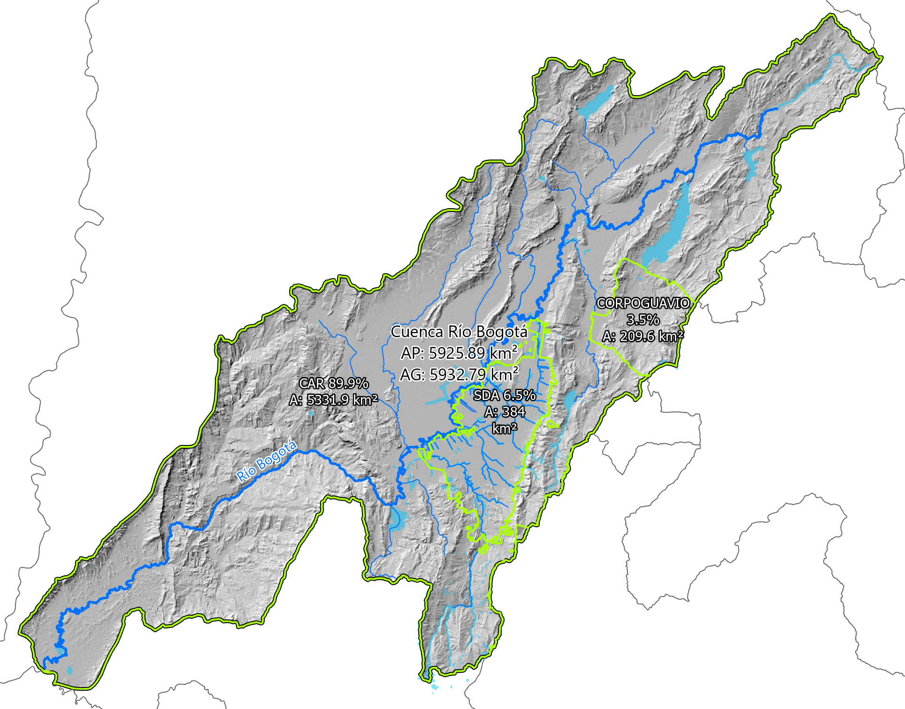

# RESEARCH: Estudio de amenazas hidráulicas en la llanura de inundación de la cuenca del Río Bogotá - Cundinamarca - Colombia  
"Study of hydraulic hazards in the floodplain of the Bogotá River basin - Cundinamarca - Colombia."  
Keywords: `case-study` `colombia` `bogota-river` `sudden-discharge` `hec-ras` `iber` `ansys-fluent` `hydraulic-modeling` `2D-modeling` `dam-branching` `newtonian-fluid` `non-newtonian-fluid` `hydraulic-hazard`

**_Hydro-Bogotá_** es un proyecto de investigación colaborativa que busca integrar y generar conocimiento científico alrededor del estudio del ciclo hidrológico y su asociación con los fenómenos producidos por la escorrentía en la cuenca hidrográfica del Río Bogotá.

_**Descargos de responsabilidad:** rcfdtools y los demás investigadores asociados a este estudio, No se responsabilizan de la aplicación y uso de los resultados obtenidos a través de sus modelos y las herramientas computacionales utilizadas, o de los contenidos presentados en esta investigación. Es responsabilidad de los usuarios: verificar, comparar, evaluar y analizar Sí los scripts, algoritmos, funciones, geo-procesos aplicados y resultados, cumplen con las metodologías, normas y estándares de análisis aplicables en ingeniería, estadística, hidrología e hidráulica y demás profesiones afines involucradas._

 Hydro-Bogotá en Nodo Científico de la Universidad Escuela Colombiana de Ingeniería https://www.youtube.com/watch?v=3x50uoyNs5E  

## 1. Objetivos

El objetivo principal de esta investigación, es ensamblar un modelo numérico de gran escala, que permita representar el transporte del flujo y las inundaciones producidas por eventos y fenómenos extremos en la cuenca del Río Bogotá, tales como:

* Crecientes súbitas generadas por lluvias extremas.
* Descargas súbitas por colapso de embalses debidas a fallos estructurales producidos por fenómenos de erosión, o por ocurrencia de eventos sísmicos de gran magnitud.
* Descargas no controladas por fallo o colapso en estructuras hidráulicas, canales, vertederos, túneles de excesos y de emergencia, obstrucción de compuertas, rompimiento de diques, estructuras en zonas de amortiguación, entre otros. 

> Complementariamente, el modelo ensamblado podrá ser utilizado como soporte en la delimitación de la ronda hídrica en los componentes geomorfológico e hidrológico, de los drenajes (sistemas lóticos) y cuerpos de agua (sistemas lénticos) localizados en la cuenca.

### 1.1. A corto plazo

* Integrar un modelo digital de elevación híbrido (DEM) combinando información de sensores remotos satelitales (ALOS PALSAR 12.5 m con ajuste de elevaciones a partir de información Lidar o Copernicus 30 m), levantamientos Lidar Bogotá (5 m y 0.5 m) y bloques de obstrucción generados a partir del catastro de construcciones urbanas y rurales en zonas con información Lidar.
* Localizar las intersecciones de pasos de vía, con canales y drenajes a superficie libre del sistema de alcantarillado pluvial en el área urbana de Bogotá.
* Ajustar el modelo digital de elevación removiendo las sobreelevaciones producidas por pasos de vía (vehiculares y peatonales) sobre canales y drenajes en el área urbana de Bogotá.
* Digitalizar los alineamientos de las coronas de diques en canales (en zonas con cobertura Lidar) para utilizarlas como líneas de refinamiento (Breaklines) del mallado 2D. Digitalizar líneas de transición de mallado alrededor de los corredores de drenaje.
* Complementar la red de drenaje urbana y rural de la cuenca del Río Bogotá, incluyendo las conexiones de descarga de los sistemas de embalses (reguladores y generación eléctrica), a los drenajes principales receptores de la red hídrica. La red de drenaje se utiliza como elemento de refinamiento (Breaklines) del mallado 2D.
* Homologar el [Mapa de Suelos del Territorio Colombiano a escala 1:100.000 con cubrimiento a Cundinamarca](https://geoportal.igac.gov.co/contenido/datos-abiertos-agrologia) del [Instituto Geográfico Agustín Codazzi - IGAC](https://www.igac.gov.co/), a los grupos hidrológicos del SCS de la [USDA](https://www.usda.gov/) o departamento de Agricultura de los Estados Unidos de América y establecer tasas de infiltración.
* Homologar el [Mapa de Clasificación de las Tierras por su Vocación de Uso a escala 1:100.000](https://geoportal.igac.gov.co/contenido/datos-abiertos-agrologia) del [Instituto Geográfico Agustín Codazzi - IGAC](https://www.igac.gov.co/) a tipos de cobertura estableciendo valores asociados de rugosidad de Manning y porcentajes de impermeabilidad.
* Crear la _Versión v0_ del prototipo funcional de simulación hidráulica 2D en HEC-RAS (no calibrado y con refinamiento de mallado solo a partir de ejes de drenajes), que permita evaluar descargas súbitas por colapso o fallo estructural de los embalses Neusa, Tominé, Sisga, San Rafael, Chisacá y La Regadera.

> En esta etapa no se considera el ajuste de los fondos Lidar (a partir de planos de ingeniería de detalle o utilizando levantamientos topo-batimétricos) en canales debidas al transporte regular del flujo, considerando que ante eventos extremos, la fracción correspondiente al volúmen ya trasportado, reduce su capacidad hidráulica.
> 
> Las líneas de transición de mallado `BankSide = 'Cell Transition'` digitalizadas en la capa de Bancas, permiten realizar un cambio gradual entre el tamaño de celda definido para cada drenaje y el tamaño global de celdas definido en el mallado.

### 1.2. A mediano plazo

* Ajustar los mapas de suelos y usos incluyendo la digitalización (escala 1:25000 o inferior) de los corredores de canales a superficie libre para optimizar los valores asociados de infiltración, rugosidad de Manning e impermeabilidad.
* Incorporación de levantamiento Lidar (0.5 m) de la zona de descarga del Río Bogotá entre la descarga del Río Tunjuelo y el Salto del Tequendama. El modelo de terreno ensamblado no dispone de información detallada de este corredor, lo que ocasiona que el flujo de la llanura no pueda ser drenado completamente luego de la descarga súbita desde los embalses.
* Crear la _Versión v1_ del prototipo funcional de simulación hidráulica 2D en HEC-RAS con inclusión de líneas de banca para direccionamiento de flujo y líneas de transición de mallado (actualmente, ya se encuentra creado el mallado y se están ajustando las celdas con más de 8 caras).
* Calibrar el modelo numérico construído a partir de información de eventos históricos documentados.
* Fomentar la participación de entidades gubernamentales locales (Alcaldías, Empresas de Servicios Públicos, Corporaciones Autónomas, cuerpos de atención de emergencias y desastres, gestores del riesgo y cambio climático como el IDIGER) y áreas adscritas a centros de educación superior (centros de estudios, semilleros, grupos de investigación), para la optimización del modelo y la difusión del conocimiento obtenido en la presente investigación.
* Desarrollar casos de estudios específicos dentro de la zona de estudio (trabajos de grado, investigación de semilleros).
* Incorporar gradualmente al modelo digital de elevación híbrido (DEM), levantamientos Lidar complementarios de los municipios y zonas ubicadas en las llanuras de inundación del Río Bogotá, Río Neusa, Río Tominé, Río Sisga, Río Teusacá (desde el Embalse San Rafael), Río Chisacá y Río Tunjuelo (hasta el límite del Lidar 0.5 m extendido 2020). 
* Localizar las intersecciones de pasos de vía con canales y drenajes a superficie libre, del sistema de alcantarillado pluvial en la zona rural y en municipios de la sabana de Bogotá.
* Ajustar el modelo digital de elevación removiendo las sobreelevaciones producidas por pasos de vía (vehiculares y peatonales) en las zonas Lidar complementarias incorporadas (incorporación gradual a partir de información suministrada por entidades).
* Inclusión de estructuras y equipos hidráulicos: diques, culverts, compuertas, bombeos, zonas de amortiguación.
* A partir del estudio hidrológico de la cuenca y utilizando información de sensores remotos satelitales de re-análisis ERA-5, simular eventos extremos con diferentes periodos de recurrencia.
* A partir de la simulación hidráulica 2D de eventos extremos y descargas súbitas en la cuenca, crear mapas de amenaza utilizando los lineamientos del [Austrailian Emergency Management Handbook Series - Techinical flood risk mangement guideline: Flood Hazard](https://knowledge.aidr.org.au/media/1891/guideline-7-3-technical-flood-risk-management.pdf).

### 1.3. A largo plazo

* Ajuste de secciones en canales a partir de levantamientos topo-batimétricos para evaluación de la capacidad hidráulica máxima del sistema de drenaje a superficie libre. Requerido debido a que a partir de levantamientos Lidar, las secciones representan el fondo a partir de la lámina de agua presente en el momento de la captura de puntos.
* Simulación hidráulica 2D y comparación de mapas de amenazas usando diferentes herramientas de simulación numérica: [HEC-RAS](https://www.hec.usace.army.mil/software/hec-ras/), [IBER](https://flumen.upc.edu/en/documents/software/iber) y [MIKE11](https://www.dhigroup.com/technologies/mikepoweredbydhi/mikeplus-rivers).
* Simulación hidráulica 2D del rompimiento de las represas de los embalses reguladores del sistema hidráulico de la cuenca, debida a fenómenos de erosión.
* Simulación hidráulica 2D de sedimentos transportados en la cuenca.
* Simulación hidráulica 2D [No Newtoniana](https://www.hec.usace.army.mil/confluence/rasdocs/rasmuddebris/non-newtonian-user-s-manual) de rompimiento de las represas de los embalses reguladores, incluyendo el transporte de los materiales que conforman sus estructuras.
* Simulación hidráulica 1D/2D de operación de los embalses reguladores de la cuenca.

## 2. Embalses, municipios y autoridades ambientales sobre la cuenca Río Bogotá

### 2.1. Embalses

La cuenca del Río Bogotá, localizada en el Departamento de Cundinamarca - Colombia, tiene una extensión planar de 5925.89 km² (5932.79 km² geodésicos), y dentro de ella se encuentran los siguientes embalses reguladores en zonas altas:

|                                    Google                                    | Cuerpo de agua (wiki)                                                                                    | Superficie (km²) | Capacidad (hm³)  |  Flujo medio (m³/s)  |
|:----------------------------------------------------------------------------:|:---------------------------------------------------------------------------------------------------------|:----------------:|:----------------:|:--------------------:|
| [:globe_with_meridians:](http://maps.google.com/maps?q=5.036403,-73.811914)  | [Embalse Tominé](https://es.wikipedia.org/wiki/Embalse_de_Tomin%C3%A9)                                   |    29.938931     |      689.5       |         3.9          |
| [:globe_with_meridians:](http://maps.google.com/maps?q=5.135924,-73.969663)  | [Embalse Neusa](https://es.wikipedia.org/wiki/Embalse_del_Neusa)                                         |     9.274447     |       117        |         1.8          |
|  [:globe_with_meridians:](http://maps.google.com/maps?q=5.083958,-73.72756)  | [Embalse Sisga](https://es.wikipedia.org/wiki/Represa_del_Sisga)                                         |     4.702891     |       90.1       |         2.6          |
| [:globe_with_meridians:](http://maps.google.com/maps?q=4.703225,-73.985746)  | [Embalse San Rafael ](https://es.wikipedia.org/wiki/Embalse_de_San_Rafael)                               |      3.3596      |        75        |         1.2          |
| [:globe_with_meridians:](http://maps.google.com/maps?q=4.384184,-74.167766)  | [Embalse Chisacá](https://www.banrepcultural.org/coleccion-bibliografica/especiales/embalse-de-chisaca)  |     0.498802     |       6.7        |         0.67         |
| [:globe_with_meridians:](http://maps.google.com/maps?q=4.403117,-74.143296)  | [Embalse La Regadera](https://archivobogota.secretariageneral.gov.co/noticias/embalse-la-regadera)       |     0.274918     |       3.3        |         0.53         |
|                                                                              | Σ                                                                                                        |    48.049589     |      981.6       |         10.7         |

 Embalses reguladores dentro de la cuenca del Río Bogotá (norte hacia arriba).
  

> Por su localización geográfica en llanura, en esta investigación no se consideran los Embalses de Aposentos, Muña y humedales de Bogotá como elementos generadores de riesgo, razón por la cual, no se incluyen en la modelación de descarga súbita y son solo utilizados como cuerpos de amortiguación de crecientes.
>
> En el embalse seco de Cantarrana, no se han incluido descargas súbitas directas; lo anterior debido a que es utilizado solo para atenuación de las crecientes provenientes de la parte alta del Río Tunjuelo y desde los embalses Chisacá y La Regadera, los cuales sí incluyen hidrogramas de descarga.
> 
> Los valores indicados en la tabla han sido recopilados de diferentes fuentes de información y están sujetos a futuras actualizaciones, cuando se disponga de la información topo-batimétrica de cada uno de estos cuerpos de agua.
> 
> El flujo medio de 0.53 m³/s definido en el Embalse La Regadera, corresponde a la resta de 1.2 m³/s descargados en este cuerpo de agua, menos el valor definido en el Embalse Chisacá.
>
> El área superficial de cada cuerpo ha sido calculado a partir del área planar, utilizando el sistema de proyección de coordenadas Magna Origen único Nacional (EPSG 9377).

### 2.2. Municipios y distrito

De acuerdo con la capa geográfica de _Municipios, Distritos y Áreas no municipalizadas de Colombia (versión 2024.06.30)_ del Instituto Geográfico Agustín Codazzi - IGAC, y tomando como referencia el límite de la subzona hidrográfica 2120 del IDEAM, los 47 municipios (incluido el distrito capital) con influencia geográfica directa sobre la cuenca del Río Bogotá en el Departamento de Cundinamarca son:

 Municipios con influencia geográfica sobre la cuenca del Río Bogotá (norte hacia arriba).
  

| Código | Nombre                     |  Área en cuenca (km²)  | % en cuenca |  Área Mpio. (km²)  |  % Mpio.  |
|:------:|:---------------------------|:----------------------:|:-----------:|:------------------:|:---------:|
| (n/a)  | (área no coincidente)      |         13.17          |    0.22     |       13.17        |    100    |
| 25001  | Agua de Dios               |         71.02          |     1.2     |       85.95        |   82.63   |
| 25035  | Anapoima                   |         123.39         |    2.08     |       123.95       |   99.55   |
| 25040  | Anolaima                   |         110.28         |    1.86     |       120.95       |   91.18   |
| 25599  | Apulo                      |         121.92         |    2.06     |       121.97       |   99.95   |
| 11001  | Bogotá D.C.                |         845.34         |    14.25    |      1620.07       |   52.18   |
| 25099  | Bojacá                     |         102.32         |    1.72     |       102.32       |    100    |
| 25123  | Cachipay                   |         53.45          |     0.9     |       53.45        |    100    |
| 25126  | Cajicá                     |         51.32          |    0.87     |       51.32        |    100    |
| 25175  | Chía                       |         80.13          |    1.35     |       80.13        |    100    |
| 25178  | Chipaque                   |          5.49          |    0.09     |       150.55       |   3.65    |
| 25183  | Chocontá                   |         254.51         |    4.29     |       300.09       |   84.81   |
| 25200  | Cogua                      |         132.75         |    2.24     |       132.88       |   99.91   |
| 25214  | Cota                       |         53.74          |    0.91     |       53.74        |    100    |
| 25224  | Cucunubá                   |         24.13          |    0.41     |       109.84       |   21.97   |
| 25245  | El Colegio                 |         118.27         |    1.99     |       118.27       |    100    |
| 25260  | El Rosal                   |         70.55          |    1.19     |       87.22        |   80.89   |
| 25269  | Facatativá                 |         154.98         |    2.61     |       158.05       |   98.06   |
| 25286  | Funza                      |         70.05          |    1.18     |       70.05        |    100    |
| 25295  | Gachancipá                 |         42.92          |    0.72     |       42.92        |    100    |
| 25307  | Girardot                   |         74.84          |    1.26     |       130.33       |   57.42   |
| 25312  | Granada                    |         11.46          |    0.19     |        60.7        |   18.88   |
| 25322  | Guasca                     |         209.56         |    3.53     |       360.58       |   58.12   |
| 25326  | Guatavita                  |         153.96         |     2.6     |       252.35       |   61.01   |
| 25377  | La Calera                  |         189.19         |    3.19     |       326.78       |   57.89   |
| 25386  | La Mesa                    |         148.09         |     2.5     |       148.27       |   99.88   |
| 25430  | Madrid                     |         119.58         |    2.02     |       119.58       |    100    |
| 25473  | Mosquera                   |         106.13         |    1.79     |       106.13       |    100    |
| 25486  | Nemocón                    |         98.36          |    1.66     |       98.36        |    100    |
| 25596  | Quipile                    |         30.98          |    0.52     |       127.7        |   24.26   |
| 25612  | Ricaurte                   |         92.81          |    1.56     |       128.01       |   72.5    |
| 25645  | San Antonio del Tequendama |         88.14          |    1.49     |       88.57        |   99.52   |
| 25736  | Sesquilé                   |         140.97         |    2.38     |       141.19       |   99.85   |
| 25740  | Sibaté                     |         93.76          |    1.58     |       122.04       |   76.83   |
| 25754  | Soacha                     |         176.15         |    2.97     |       187.45       |   93.97   |
| 25758  | Sopó                       |         111.04         |    1.87     |       111.04       |    100    |
| 25769  | Subachoque                 |         188.52         |    3.18     |       209.22       |   90.11   |
| 25772  | Suesca                     |         137.04         |    2.31     |       173.26       |   79.09   |
| 25785  | Tabio                      |         75.22          |    1.27     |       75.22        |    100    |
| 25793  | Tausa                      |         138.74         |    2.34     |       201.87       |   68.73   |
| 25797  | Tena                       |         51.44          |    0.87     |       51.44        |    100    |
| 25799  | Tenjo                      |         114.15         |    1.92     |       114.15       |    100    |
| 25815  | Tocaima                    |         243.54         |     4.1     |       245.77       |   99.09   |
| 25817  | Tocancipá                  |         73.25          |    1.23     |       73.25        |    100    |
| 25873  | Villapinzón                |         128.6          |    2.17     |       226.14       |   56.87   |
| 25878  | Viotá                      |         200.85         |    3.39     |       201.29       |   99.78   |
| 25898  | Zipacón                    |          54.2          |    0.91     |        54.2        |    100    |
| 25899  | Zipaquirá                  |         182.49         |    3.08     |       194.83       |   93.66   |
|        | Σ                          |        5932.79         |     100     |      7926.61       |           |

> Dentro de estos municipios y el distrito capital, existen asentamientos humanos que por su localización geográfica, pueden estar expuestos a amenazas de inundación.
> _**% en cuenca**_: corresponde al porcentaje del área geodésica municipal, con respecto a toda la cuenca del Río Bogotá.   
> _**% Mpio.**_: corresponde al porcentaje del área geodésica municipal dentro de la cuenca del Río Bogotá, con respecto al área total del municipio.

### 2.3. Autoridades ambientales

> Las Corporaciones Autónomas Regionales y de Desarrollo Sostenible, son entes corporativos de carácter público, creados por la ley, integrados por las entidades territoriales que por sus características constituyen geográficamente un mismo ecosistema o conforman una unidad geopolítica, biogeográfica o hidrogeográfica, dotados de autonomía administrativa y financiera, patrimonio propio y personería jurídica, encargados por la ley de administrar, dentro del área de su jurisdicción el medio ambiente y los recursos naturales renovables y propender por su desarrollo sostenible, de conformidad con las disposiciones legales y las políticas del Ministerio del Medio Ambiente.[^1]

De acuerdo con la capa geográfica de _Límites autoridades ambientales de Colombia (versión 2019)_ del Ministerio de Ambiente y Desarrollo Sostenible, y tomando como referencia el límite de la subzona hidrográfica 2120 del IDEAM, las 3 autoridades ambientales con influencia geográfica directa sobre la cuenca del Río Bogotá son:

 Autoridades ambientales con influencia geográfica sobre la cuenca del Río Bogotá (norte hacia arriba).
  

| Autoridad ambiental - AA | Nombre                                        | Área en cuenca (km²) | % en cuenca |  Área AA. (km²)  |   % AA.   |
|:-------------------------|:----------------------------------------------|:--------------------:|:-----------:|:----------------:|:---------:|
| (n/a)                    | (área no coincidente)                         |         7.29         |    0.12     |       7.29       |    100    |
| CAR                      | Corporación Autónoma Regional de Cundinamarca |       5331.94        |    89.87    |      18289       |   29.15   |
| CORPOGUAVIO              | Corporación Autónoma Regional del Guavio      |        209.56        |    3.53     |     3635.01      |   5.77    |
| SDA                      | Secretaria Distrital de Ambiente Bogotá       |        383.99        |    6.47     |      383.99      |    100    |
|                          | Σ                                             |       5932.79        |     100     |     22315.3      |     0     |

> _**% en cuenca**_: corresponde al porcentaje del área geodésica del límite de la autoridad ambiental, con respecto a toda la cuenca del Río Bogotá.   
> _**% AA.**_: corresponde al porcentaje del área geodésica del límite de la AA dentro de la cuenca del Río Bogotá, con respecto al área total de la AA.

## 3. Sistema de proyección de coordenadas - CRS

Para las clases de entidad, mapas y modelos utilizados en esta investigación, se ha utilizado el sistema de referencia de coordenadas Magna Origen Único Nacional de Colombia (EPSG 9377).

El establecimiento de las condiciones técnicas mínimas que deben tener los productos básicos de cartografía oficial, serán los definidos de conformidad con lo dispuesto por la Resolución 471 del 14 de mayo de 2020 y la posterior Resolución 529 del 05 de junio de 2020, emitidas por el Instituto Geográfico Agustín Codazzi - IGAC, o la norma que la modifique y sustituya, para ello y para garantizar la homogeneidad y continuidad en la representación de los elementos del territorio, así como facilitar los trabajos relacionados con la gestión de coordenadas en el país. En tal sentido, los proyectos, obras o actividades, sujetos al licenciamiento ambiental, deben ajustar su información geográfica a los lineamientos establecidos en la referida normatividad, para la evaluación y seguimiento de los estudios ambientales y/o presentación de los Informes de Cumplimiento Ambiental. El sistema de proyección cartográfico para Colombia, con un único origen, consiste en una proyección cartográfica Transversa de Mercator Secante, cuyos parámetros están establecidos en el literal i Sistema de Referencia del artículo 4 de la resolución 471 de 2020, los cuales pueden configurarse en software especializado para procesamiento de información geográfica.

* Proyección cartográfica: origen nacional único Colombia EPSG: 9377 o ESRI: 103599
* Archivo: MAGNA_OrigenNacional.prj (disponible en la carpeta .`data` o `.projectionfile` del modelo hidráulico)
* Referencia: https://www.anla.gov.co/entidad/tematicas/instrumentos-permisos-y-tramites-ambientales/sistema-de-informacion-geografica
* Falso norte: 2000000 metros
* False este: 5000000 metros

`PROJCS["MAGNA_Colombia_Origen_Unico",GEOGCS["GCS_MAGNA",DATUM["D_MAGNA",SPHEROID["GRS_1980",6378137.0,298.257222101]],PRIMEM["Greenwich",0.0],UNIT["Degree",0.0174532925199433]],PROJECTION["Transverse_Mercator"],PARAMETER["False_Easting",5000000.0],PARAMETER["False_Northing",2000000.0],PARAMETER["Central_Meridian",-73.0],PARAMETER["Scale_Factor",0.9992],PARAMETER["Latitude_Of_Origin",4.0],UNIT["Meter",1.0]]`

> :lady_beetle:Atención: para la correcta asociación de las clases de entidad o vectores y los modelos digitales de elevación utilizados para la construcción del modelo hidráulico utilizando RAS Mapper en HEC-RAS, todos los archivos deberán utilizar el sistema de proyección único 9377 definidos a partir del archivo _MAGNA_OrigenNacional.prj_.

## 4. Fuentes de información [(.data)](file/data/Readme.md)

La siguiente tabla contiene la identificación de fuentes de datos (vectoriales, grillas, series de datos) utilizadas en el desarrollo de la presente investigación. Para conocer los datos fuente recopilados para este estudio, diríjase a la carpeta [.data](file/data/Readme.md) de este repositorio.

> Tablas de datos y clases de entidad, incluyen un campo numérico entero largo denominado `DSourceID` que contiene el código de la fuente de datos. Tenga en cuenta que no todos los registros pueden estar asociados a una única fuente, p. ej., la red de drenaje cuya fuente principal es la Empresa de Acueducto y Alcantarillado de Bogotá - EAAB, puede contener registros de la fuente 1 debidas a nuevas incorporaciones de elementos de la red o por ajuste o re-digitalización de los mismos.

| DSourceID | DSourceNam | Descripción                                                                                                                                                                                                                    |
|:---------:|:-----------|:-------------------------------------------------------------------------------------------------------------------------------------------------------------------------------------------------------------------------------|
|     0     | N/A        | Fuente de datos no definida o no asociada                                                                                                                                                                                      |
|     1     | rcfdtools  | [rcfdtools](https://github.com/rcfdtools): digitalización de entidades, homologación de atributos, ensamble de modelos                                                                                                         |
|     2     | NASA       | [The National Aeronautics and Space Administration](https://www.nasa.gov/): modelo digital de elevación - DEM, synthetic aperture radar - [SAR](https://asf.alaska.edu/information/sar-information/what-is-sar/)               |
|     3     | IGAC       | [Instituto Geográfico Agustín Codazzi](https://www.igac.gov.co/): mapas base, mapa de suelos, mapa de vocaciones de uso                                                                                                        |
|     4     | EAAB       | [Empresa de Acueducto y Alcantarillado de Bogotá](https://www.acueducto.com.co/): redes de drenaje, cuerpos de agua, Lidar, topo-batimetrías, estructuras hidráulicas                                                          |
|     5     | IDECA      | [Unidad Administrativa Especial de Catastro Distrital](https://www.catastrobogota.gov.co/) - [Infraestructura de Datos Espaciales para el Distrito Capital](https://www.ideca.gov.co/): construcciones, puentes y pasos de vía |
|     6     | CAR        | [Corporación Autónoma Regional de Cundinamarca](https://www.car.gov.co/): Lidar, topo-batimetrías, puentes y pasos de vía, estructuras hidráulicas                                                                             |
|     7     | Copernicus | [Copernicus Europe's Eyes on Earth](https://www.copernicus.eu/en): modelo digital de elevación - DEM, synthetic aperture radar - [SAR](https://asf.alaska.edu/information/sar-information/what-is-sar/) de alta resolución     |

## 5. Modelos digitales de elevación [(.dem)](file/dem/Readme.md)

Para el ensamble del modelo digital de elevación híbrido de la cuenca, se ha utilizado el modelo digital de superficie – DSM Copernicus (resolución de 30 metros), los modelos digitales de terreno LIDAR de la ciudad de Bogotá D.C. (resoluciones de 5 y 0.5 metros), un modelo de elevación generado a partir de polígonos de construcciones (resolución de 0.5 metros) y un modelo digital de terreno con los canales a superficie libre en puntos de intersección de drenajes con pasos de vía (resolución 0.5 metros). 

Los modelos digitales de elevación (de terreno o DTM, de superficie o DSM e híbridos), han sido utilizados en las simulaciones hidráulicas 2D para obtener las propiedades geométricas de las celdas del modelo. Los modelos digitales de terreno en canales (localizados en puntos de intersección de pasos de vía con drenajes) generados a partir de secciones de muestreo y ejes, son utilizados para la corrección o limpieza de canales en pasos de vía.

https://github.com/user-attachments/assets/b08fd7ae-8f4a-4b59-bc0d-b3ce6d48ecdd

Dentro de la carpeta [_.dem_](file/dem/Readme.md) y en [_Releases_](https://github.com/rcfdtools/R.HydroBogota/releases) podrá encontrar los siguientes modelos digitales de elevación e información detalladas de sus metadatos:

* Modelo digital de superficie DSM satelital NASA ALOS PALSAR (12.5 m)
* Modelo digital de superficie DSM satelital Copernicus (30 m)
* Modelo digital de terreno DTM Lidar Bogotá 2014 - 2020 extendido (0.5 m)
* Modelo digital de construcciones DSM (0.5 m)
* Modelo digital de terreno DTM Híbrido Lidar Extendido con Construcciones (0.5 m)
* Modelo digital de canales en pasos de vía (0.5 m)
* Modelo digital de terreno DTM Híbrido Copernicus, Lidar con Construcciones y Canales ajustados en pasos de vía

Ejemplo de modelo digital de terreno con y sin ajuste  

## 6. Capas vectoriales Shapefile  [(.shp)](file/shp/Readme.md)

Los archivos vectoriales o capas shapefile (.shp) procesadas para el ensamble y validación del modelo hidráulico, han sido re-proyectados al sistema de coordenadas 9377 Magna Orígen Único Nacional de Colombia.

Dentro de la carpeta [.shp](file/shp/Readme.md) podrá encontrar las siguientes capas e información detalladas de sus metadatos:

* Construcciones (polígono y centroide)
* Cuerpos de agua (polígono)
* Drenajes (línea)
* Bancas - Banks (línea)
* Breaklines (línea)
* Cundinamarca - Límite (polígono)
* Cundinamarca - Land Cover (polígono)
* Cundinamarca - Suelos (polígono)
* Delimitación modelos digitales de elevación DEM (polígono)
* Red de muestreo para ajuste de DSM NASA ALOS PALSAR (punto)
* Intersección Drenaje - Vía (punto)
* Subzona hidrográfica 2120 - Río Bogotá (polígono)
* Municipios y distrito sobre cuenca Río Bogotá (polígono)
* Autoridades ambientales sobre cuenca Río Bogotá (polígono)

Ejemplo de capas vectoriales disponibles  

## 7. Modelos numéricos hidráulicos

Para las simulaciones hidráulicas se utilizarán las siguientes herramientas computacionales y modelos:

* Modelo [HEC-RAS](file/hec/HEC-RAS.md)
* Modelo IBER (disponible para implementación por investigador externo)
* Modelo Mike (disponible para implementación por investigador externo)
* Modelo DELFD3D (disponible para implementación por investigador externo)
* Modelo OpenFoam (disponible para implementación por investigador externo)

 
 HEC-RAS vs. Iber vs. Mike. Tomado de: íconos oficiales de aplicaciones (ajustados a B/N).
 

## Referencias generales [(.ref)](file/ref/Readme.md)

* https://damfailures.org/
* [Austrailian Emergency Management Handbook Series - Techinical flood risk mangement guideline: Flood Hazard.](https://www.hec.usace.army.mil/confluence/rasdocs/rmum/latest/raster-calculator)
* https://www.usgs.gov/faqs/what-liquefaction
* https://damfailures.org/wp-content/uploads/2021/11/conduits_embankment_dams.pdf
* https://datosgeograficos.car.gov.co/

Referencias complementarias y documentación de uso libre recopilada y disponible en [.ref](file/ref/Readme.md) de este repositorio.

[^1]: https://archivo.minambiente.gov.co/index.php/noticias/2067

